<!-- markdownlint-disable MD025 MD033 -->

--8<-- "includes/quicknav.html"

# AI Consciousness (Operational View)

  

    

      
A practical note

      <h2 class="landing-title">Consciousness is a fascinating question — but it’s the wrong dependency for safety.</h2>
      

        We build <strong>glass-box</strong> systems for high-stakes work: auditable traces, enforceable constraints, and abstention when evidence is missing.
        None of that requires a system to be conscious.
      

      

        <a class="md-button md-button--primary" href="/reasoners/governance/">Governance approach</a>
        <a class="md-button" href="/methodology/constraints/">Constraints &amp; SHACL</a>
        <a class="md-button" href="/philosophy/ai-agent-vs-agentic-ai/">Agent vs agentic</a>
      

    

  

## The core claim

  

    
<strong>Whether a model is conscious is (currently) not a reliable input to governance.</strong>

    
We can’t operationally measure consciousness with high confidence. We can measure failure modes, trace quality, constraint coverage, and abstention behavior.

  

## Why consciousness debates derail real safety

```mermaid
flowchart TB
%% Styles (brModel Standard)
classDef i fill:#D3D3D3,stroke-width:0px,color:#000;
classDef p fill:#B3D9FF,stroke-width:0px,color:#000;
classDef r fill:#FFFFB3,stroke-width:0px,color:#000;
classDef o fill:#C1F0C1,stroke-width:0px,color:#000;
classDef s fill:#FFB3B3,stroke-width:0px,color:#000;

I_Debate(["🧠 Consciousness debate (interesting, but not operational)"]):::i
P_Frame("🗣️ Anthropomorphic framing"):::p
R_Trust(["⚠️ Over-trust (reduced verification)"]):::r
P_Delegate("📦 Risky delegation"):::p
O_Harm(["💥 Safety failure (actions on wrong beliefs)"]):::o

P_Gates("🔒 Governance gates"):::p
R_Evidence(["🔎 Evidence + provenance"]):::r
R_Trace(["🧾 Trace logs"]):::r
O_Safe(["✅ Safer operation (refusal + audit)"]):::o

I_Debate --> P_Frame --> R_Trust --> P_Delegate --> O_Harm

R_Evidence --> R_Trust
R_Trace --> R_Trust
P_Gates -. "blocks" .-> P_Delegate
P_Gates --> O_Safe

%% Clickable nodes
click P_Gates "/reasoners/governance/" "Governance"
click R_Evidence "/philosophy/three-laws/" "Three laws"
click R_Trace "/methodology/llm-tool-rag/" "LLM + Tool + RAG"
```

  

    

      <h3>Anthropomorphism creates over-trust</h3>
      
When teams treat a fluent model like a competent employee, they skip verification and stop demanding evidence.

    

    

      <h3>Over-trust pushes responsibility upstream</h3>
      
People start outsourcing accountability to the system (“it said so”), which is exactly what high-stakes governance must prevent.

    

    

      <h3>Safety must be technical, not psychological</h3>
      
Even if a system were conscious, it could still be wrong. Governance must be enforced at the data and action layers.

    

  

    

## A simple causal model of the failure

```mermaid
flowchart TB
%% Styles (brModel Standard)
classDef i fill:#D3D3D3,stroke-width:0px,color:#000;
classDef p fill:#B3D9FF,stroke-width:0px,color:#000;
classDef r fill:#FFFFB3,stroke-width:0px,color:#000;
classDef o fill:#C1F0C1,stroke-width:0px,color:#000;
classDef s fill:#FFB3B3,stroke-width:0px,color:#000;

P_Frame("🗣️ Anthropomorphic framing"):::p
R_Trust(["⚠️ Over-trust / reduced verification"]):::r
P_Act("⚙️ Action taken"):::p
O_Fail(["💥 Wrong-belief action (safety failure)"]):::o

P_Ev("🔎 Evidence requirement"):::p
R_Trace(["🧾 Trace + provenance"]):::r
P_Verify("✅ Verification"):::p

P_Gov("🔒 Governance constraints"):::p
O_Block(["🛑 Block / refuse"]):::o

P_Frame --> R_Trust --> P_Act --> O_Fail
P_Ev --> P_Verify --> R_Trust
R_Trace --> P_Verify
P_Gov -. "blocks" .-> P_Act
P_Gov --> O_Block

%% Clickable nodes
click P_Gov "/reasoners/governance/" "Governance"
click P_Ev "/philosophy/three-laws/" "Three laws"
click R_Trace "/methodology/llm-tool-rag/" "LLM + Tool + RAG"
```

The lever is not “prove consciousness”. The lever is: enforce constraints, require evidence, and design for refusal.

## Our operational stance (what we do in practice)

  

    

      <h3>1) Treat models as fallible components</h3>
      
We assume the model can be wrong in convincing ways. Safety can’t rely on “good intentions”.

    

    

      <h3>2) Make refusal explicit and normal</h3>
      
If evidence is missing or constraints fail, the system abstains or escalates — it does not improvise.

    

    

      <h3>3) Separate facts from hypotheses</h3>
      
Predictions and simulations are labeled and isolated so they don’t contaminate the evidence layer.

    

  

## Decision flow: governance-first (not consciousness-first)

```mermaid
flowchart TB
%% Styles (brModel Standard)
classDef i fill:#D3D3D3,stroke-width:0px,color:#000;
classDef p fill:#B3D9FF,stroke-width:0px,color:#000;
classDef r fill:#FFFFB3,stroke-width:0px,color:#000;
classDef o fill:#C1F0C1,stroke-width:0px,color:#000;
classDef s fill:#FFB3B3,stroke-width:0px,color:#000;

I_Q(["📥 Question / proposed action"]):::i
P_Scope("🧭 Select allowed scope"):::p
P_Check("🔒 Check constraints"):::p
G_OK{"Allowed?"}:::s

P_Retrieve("🔎 Retrieve evidence"):::p
R_Trace(["🧾 Trace + provenance"]):::r
P_Verify("✅ Verify"):::p
O_Out(["✅ Output + audit trail"]):::o

R_Refuse(["🛑 Refuse / escalate (request missing inputs)"]):::r

I_Q --> P_Scope --> P_Check --> G_OK
G_OK -->|"no"| R_Refuse
G_OK -->|"yes"| P_Retrieve --> R_Trace --> P_Verify --> O_Out

%% Clickable nodes
click P_Check "/methodology/constraints/" "Constraints & SHACL"
click R_Trace "/reasoners/governance/" "Governance"
click P_Retrieve "/methodology/llm-tool-rag/" "LLM + Tool + RAG"
```

## What we don’t claim

  

    <ul>
      <li>We do not claim to prove or disprove consciousness in current models.</li>
      <li>We do not use “consciousness” as an excuse to relax verification or governance.</li>
      <li>We do not assume moral status from fluency.</li>
    </ul>
  

## What would change our mind (falsification)

  

    
We’d update this stance if we had a reproducible, operational test that reliably predicts safety-relevant behavior better than governance metrics.

    <ul>
      <li>A measurement that forecasts hallucination-like failures under distribution shift.</li>
      <li>A measurement that forecasts policy violation likelihood without needing constraints.</li>
      <li>Evidence that “consciousness signals” causally reduce error rates in high-stakes workflows.</li>
    </ul>
  

## Where this connects

  

    

      <a class="md-button" href="/philosophy/probabilistic-ai/">Why probabilistic AI fails</a>
      <a class="md-button" href="/philosophy/three-laws/">The three laws</a>
      <a class="md-button" href="/methodology/">Methodology</a>
    

  

