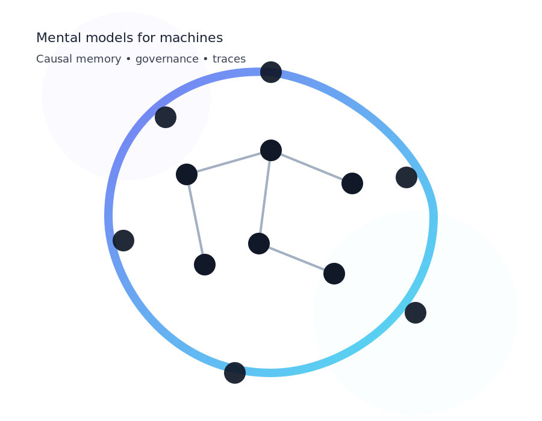
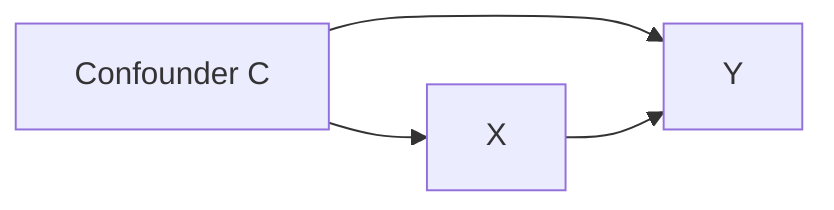
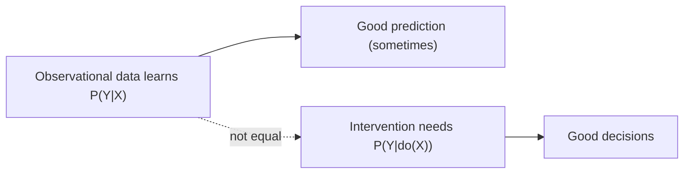

--8<-- "includes/quicknav.html"

# Correlation vs Causality

  

    

      
Decision-grade thinking

      <h2 class="landing-title">Correlation predicts. Causality intervenes.</h2>
      

        Correlation answers “what moves together?” Causality answers “what changes what — under intervention?”.
        If your system will change the world, you need causal structure.
      

      

        <a class="md-button md-button--primary" href="/methodology/causalgraphrag/">CausalGraphRAG</a>
        <a class="md-button" href="/methodology/core-primitives/">Core primitives</a>
      

    

    

      
    

  

  <h2>The operational difference</h2>
  

    

      <h3>Correlation</h3>
      
Often enough for prediction when environments are stable and you don’t change the system.

    

    

      <h3>Causality</h3>
      
Required for decisions when you will change the system (pricing, policy, treatment, automation).

    

  

## Two counterfactual statements

- If we **do** $X=x_1$ instead of $X=x_0$, the outcome $Y$ would change.
- If we remove a confounder $C$, the relationship between $X$ and $Y$ may disappear.

## Diagram: confounding vs causal effect

## Diagram: interventions change the object

## Common failure mode

A predictive model learns $P(Y|X)$.
When you intervene on $X$, you need $P(Y|do(X))$.
Those are not the same object.

  <h2>Common traps (and what to do instead)</h2>
  

    

      <h3>Confounding</h3>
      
A third variable drives both X and Y. Fix: model confounders explicitly or design an identification strategy.

    

    

      <h3>Selection bias</h3>
      
Your data is a filtered subset of reality. Fix: track selection mechanisms and test robustness.

    

    

      <h3>Distribution shift</h3>
      
The world changes after deployment. Fix: monitor drift and revalidate assumptions continuously.

    

    

      <h3>Policy feedback</h3>
      
Interventions change incentives and behavior. Fix: explicitly model feedback loops and second-order effects.

    

  

## Where this connects in our stack

- **Philosophy**: don’t confuse predictive accuracy with reliable intervention.
- **Methodology**: encode causal structure in memory (graphs), then constrain what paths are allowed.

Next: [CausalGraphRAG](../methodology/causalgraphrag.md).
