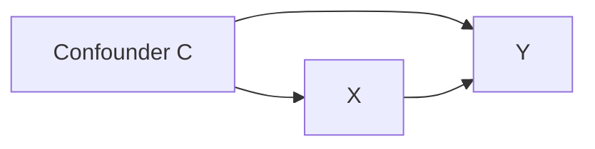
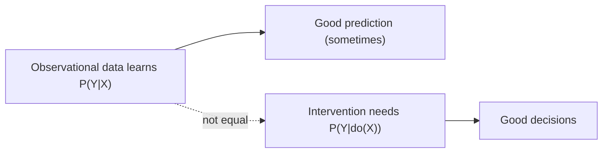

--8<-- "includes/quicknav.html"

# Correlation vs Causality

Correlation answers: *What tends to move together?*

Causality answers: *What changes what—under intervention?*

## The operational difference

- Correlation is often enough for **prediction** in stable environments.
- Causality is required for **decision-making** when you will change the system (pricing, policy, treatment, automation).

## Two counterfactual statements

- If we **do** $X=x_1$ instead of $X=x_0$, the outcome $Y$ would change.
- If we remove a confounder $C$, the relationship between $X$ and $Y$ may disappear.

## Diagram: confounding vs causal effect

## Diagram: interventions change the object

## Common failure mode

A predictive model learns $P(Y|X)$.
When you intervene on $X$, you need $P(Y|do(X))$.
Those are not the same object.

## Where this connects in our stack

- **Philosophy**: don’t confuse predictive accuracy with reliable intervention.
- **Methodology**: encode causal structure in memory (graphs), then constrain what paths are allowed.

Next: [CausalGraphRAG](../methodology/causalgraphrag.md).
