--8<-- "includes/quicknav.html"

    

# Correlation vs Causality

  

    

      
Decision-grade thinking

      <h2 class="landing-title">Correlation predicts. Causality intervenes.</h2>
      

        Correlation answers “what moves together?” Causality answers “what changes what — under intervention?”.
        If your system will change the world, you need causal structure.
      

      

        <a class="md-button md-button--primary" href="/methodology/causalgraphrag/">CausalGraphRAG</a>
        <a class="md-button" href="/methodology/core-primitives/">Core primitives</a>
      

    

  

## The operational difference

```mermaid
flowchart TB
%% Styles (brModel Standard)
classDef i fill:#D3D3D3,stroke-width:0px,color:#000;
classDef p fill:#B3D9FF,stroke-width:0px,color:#000;
classDef r fill:#FFFFB3,stroke-width:0px,color:#000;
classDef o fill:#C1F0C1,stroke-width:0px,color:#000;
classDef s fill:#FFB3B3,stroke-width:0px,color:#000;

I_Data(["📊 Past data"]):::i
P_Fit("🎯 Fit model"):::p
R_Pred(["📈 Predict $P(Y|X)$"]):::r
O_Useful(["✅ Useful when stable (and you don't change the system)"]):::o

I_Act(["🧑‍⚖️ Proposed intervention (do X)"]):::i
R_Mech(["⚙️ Mechanism model (why X changes Y)"]):::r
P_Sim("🧪 Counterfactual reasoning"):::p
R_Effects(["📎 Side-effects + constraints (what could go wrong)"]):::r
O_Decision(["✅ Decision justified under intervention"]):::o

I_Data --> P_Fit --> R_Pred --> O_Useful
I_Act --> R_Mech --> P_Sim --> R_Effects --> O_Decision

R_Pred -. "breaks under" .-> R_Effects

%% Clickable nodes
click P_Sim "/methodology/causalgraphrag/" "CausalGraphRAG"
click R_Effects "/methodology/constraints/" "Constraints & SHACL"
```

  

    

      <h3>Correlation</h3>
      
Often enough for prediction when environments are stable and you don’t change the system. It captures what co-moves in past data, but it can’t justify interventions or anticipate side effects.

    

    

      <h3>Causality</h3>
      
Required for decisions when you will change the system (pricing, policy, treatment, automation). It models how actions propagate to outcomes, separating mechanism from coincidence under intervention.

    

    

      <h3>Reasoning</h3>
      
Causality is the substrate. Reasoning adds goals, constraints, and counterfactual search over actions — so you can justify <em>why</em> an intervention is chosen and what could go wrong.

    

  

    

## Two counterfactual statements

- If we **do** $X=x_1$ instead of $X=x_0$, the outcome $Y$ would change.
- If we remove a confounder $C$, the relationship between $X$ and $Y$ may disappear.

## Diagram: confounding vs causal effect

```mermaid
flowchart TB
%% Styles (brModel Standard)
classDef i fill:#D3D3D3,stroke-width:0px,color:#000;
classDef p fill:#B3D9FF,stroke-width:0px,color:#000;
classDef r fill:#FFFFB3,stroke-width:0px,color:#000;
classDef o fill:#C1F0C1,stroke-width:0px,color:#000;
classDef s fill:#FFB3B3,stroke-width:0px,color:#000;

I_C(["🌀 Confounder C"]):::i
I_X(["X (action / exposure)"]):::i
I_Y(["Y (outcome)"]):::i

I_C --> I_X
I_C --> I_Y
I_X --> I_Y

R_Naive(["⚠️ Naive correlation mixes C → Y with X → Y"]):::r
I_C -. "unobserved" .-> R_Naive
I_X -. "observed" .-> R_Naive
I_Y -. "observed" .-> R_Naive
```

## Diagram: interventions change the object

```mermaid
flowchart TB
%% Styles (brModel Standard)
classDef i fill:#D3D3D3,stroke-width:0px,color:#000;
classDef p fill:#B3D9FF,stroke-width:0px,color:#000;
classDef r fill:#FFFFB3,stroke-width:0px,color:#000;
classDef o fill:#C1F0C1,stroke-width:0px,color:#000;
classDef s fill:#FFB3B3,stroke-width:0px,color:#000;

I_Obs(["📊 Observational world (nobody changes X)"]):::i
R_Pyx(["📈 Learn $P(Y|X)$"]):::r
O_Pred(["✅ Prediction can work (if environment stays similar)"]):::o

I_Do(["🧑‍⚖️ We change X (policy / pricing / treatment)"]):::i
R_Pydo(["📐 Need $P(Y|do(X))$"]):::r
O_Dec(["✅ Decisions require mechanism + side-effects"]):::o

I_Obs --> R_Pyx --> O_Pred
I_Do --> R_Pydo --> O_Dec

R_Pyx -. "not equal" .-> R_Pydo

%% Clickable nodes
click R_Pydo "/methodology/causalgraphrag/" "CausalGraphRAG"
```

## Common failure mode

A predictive model learns $P(Y|X)$.
When you intervene on $X$, you need $P(Y|do(X))$.
Those are not the same object.

## Common traps (and what to do instead)

```mermaid
flowchart LR
%% Styles (brModel Standard)
classDef i fill:#D3D3D3,stroke-width:0px,color:#000;
classDef p fill:#B3D9FF,stroke-width:0px,color:#000;
classDef r fill:#FFFFB3,stroke-width:0px,color:#000;
classDef o fill:#C1F0C1,stroke-width:0px,color:#000;
classDef s fill:#FFB3B3,stroke-width:0px,color:#000;

I_Obs(["📊 Observational data + correlations"]):::i

R_T1(["🌀 Confounding"]):::r
R_T2(["🎯 Selection bias"]):::r
R_T3(["🌦️ Distribution shift"]):::r
R_T4(["↩️ Reverse causality"]):::r
R_T5(["🔁 Policy feedback"]):::r
R_T6(["🎯 Goodhart / proxy gaming"]):::r

R_Bad(["❌ Bad path: treat $P(Y|X)$ as decision-grade"]):::s
P_Wrong("⚠️ Wrong intervention (do X)\n+ missing side-effects"):::s
S_Harm(["💥 Bad outcome\n(unintended harm / wasted spend)"]):::s

P_F1("Model confounders / identification"):::p
P_F2("Track selection mechanism\n+ robustness tests"):::p
P_F3("Monitor drift\n+ revalidate assumptions"):::p
P_F4("Time ordering / instruments\n+ structural tests"):::p
P_F5("Model feedback loops\n+ second-order effects"):::p
P_F6("Guardrails + mechanism\n+ anticipate adaptation"):::p

P_Good("✅ Guarded path: identify $P(Y|do(X))$\n+ governance + measurement"):::o
P_Do("🧪 Run intervention with constraints"):::p
O_Value(["✅ Better outcome\n+ audit-ready learning"]):::o

I_Obs --> R_T1
I_Obs --> R_T2
I_Obs --> R_T3
I_Obs --> R_T4
I_Obs --> R_T5
I_Obs --> R_T6

R_T1 --> R_Bad
R_T2 --> R_Bad
R_T3 --> R_Bad
R_T4 --> R_Bad
R_T5 --> R_Bad
R_T6 --> R_Bad

R_Bad --> P_Wrong --> S_Harm

R_T1 --> P_F1 --> P_Good
R_T2 --> P_F2 --> P_Good
R_T3 --> P_F3 --> P_Good
R_T4 --> P_F4 --> P_Good
R_T5 --> P_F5 --> P_Good
R_T6 --> P_F6 --> P_Good

P_Good --> P_Do --> O_Value

%% Clickable nodes
click P_Good "/methodology/causalgraphrag/" "CausalGraphRAG"
click P_F1 "/methodology/core-primitives/" "Core primitives"
click P_F5 "/philosophy/ai-agent-vs-agentic-ai/" "Agent vs agentic"
click P_F6 "/reasoners/governance/" "Governance"
click P_Do "/methodology/constraints/" "Constraints & SHACL"
```

  

    

      <h3>Confounding</h3>
      
A third variable drives both X and Y. Fix: model confounders explicitly or design an identification strategy.

    

    

      <h3>Selection bias</h3>
      
Your data is a filtered subset of reality. Fix: track selection mechanisms and test robustness.

    

    

      <h3>Distribution shift</h3>
      
The world changes after deployment. Fix: monitor drift and revalidate assumptions continuously.

    

    

      <h3>Reverse causality</h3>
      
Y drives X (or both co-evolve), so the arrow points the other way. Fix: use time ordering, instruments, or explicit structural assumptions — then test implications.

    

    

      <h3>Policy feedback</h3>
      
Interventions change incentives and behavior. Fix: explicitly model feedback loops and second-order effects.

    

    

      <h3>Goodhart / proxy gaming</h3>
      
Optimizing a proxy breaks the link to the real goal. Fix: model the mechanism, include guardrail outcomes, and anticipate strategic adaptation.

    

  

## Where this connects in our stack

- **Philosophy**: don’t confuse predictive accuracy with reliable intervention.
- **Methodology**: encode causal structure in memory (graphs), then constrain what paths are allowed.

Next: [CausalGraphRAG](../methodology/causalgraphrag.md).
