--8<-- "includes/quicknav.html"

    

# Why Probabilistic AI Fails (in High-Stakes Work)

	

		

			
Failure mechanics

			<h2 class="landing-title">Plausibility is not epistemic validity.</h2>
			

				Next-token prediction is a powerful compression engine. In high-stakes work, its core risk is not “inaccuracy” —
				it’s <strong>unverifiable confidence</strong>.
			

			

				<a class="md-button md-button--primary" href="/methodology/constraints/">Constraints &amp; SHACL</a>
				<a class="md-button" href="/philosophy/three-laws/">The three laws</a>
				<a class="md-button" href="/reasoners/governance/">Governance approach</a>
			

		

	

## The illusion

	

		
<strong>LLMs are excellent at generating text that resembles correct answers.</strong> But resemblance is not the same as truth.

		
In practice, fluency can mask missing sources, missing constraints, and missing causal structure.

	

## Why RAG helps — and why it still fails

	

		

			<h3>Causal questions</h3>
			
“Why did X happen?” requires mechanisms and context, not just relevant passages.

		

		

			<h3>Exceptions and footnotes</h3>
			
Policies and regulations live in edge cases. Retrieval often misses the clause that flips the decision.

		

		

			<h3>Cross-document constraints</h3>
			
“This is allowed only if A and B and not C” is a constraint problem. Text similarity doesn’t enforce it.

		

	

## What changes with glass-box systems

	

		

			<h3>Traceable path</h3>
			
The system shows the reasoning path it took — not just a final answer.

		

		

			<h3>Explicit sources</h3>
			
Every claim has provenance (where it came from, why it was selected).

		

		

			<h3>Enforced constraints</h3>
			
Constraints are gates. If a constraint fails, the system refuses or escalates.

		

	

	
If the system can’t provide path + sources + constraints, it must abstain. This is not a UX preference — it’s an architectural constraint.

## Diagram: plausible text vs decision-grade pipeline

```mermaid
flowchart TB
%% Styles (brModel Standard)
classDef i fill:#D3D3D3,stroke-width:0px,color:#000;
classDef p fill:#B3D9FF,stroke-width:0px,color:#000;
classDef r fill:#FFFFB3,stroke-width:0px,color:#000;
classDef o fill:#C1F0C1,stroke-width:0px,color:#000;
classDef s fill:#FFB3B3,stroke-width:0px,color:#000;

S_User("👤 User"):::s
I_Req(["📥 Request / decision context"]):::i

P_LLM("🧠 LLM generates"):::p
R_Text(["📝 Plausible text"]):::r
O_Risk(["⚠️ Risk: confident fabrication (missing evidence + missing constraints)"]):::o

P_Retrieve("🧭 Retrieve evidence"):::p
R_Evidence(["🔎 Evidence set (sources + provenance)"]):::r
P_Validate("🔒 Validate constraints"):::p
G_OK{"Valid?"}:::s
R_Trace(["🧾 Trace log (what/why/source)"]):::r
O_Decision(["✅ Decision-grade output (answer + audit trail)"]):::o
O_Refuse(["🛑 Refuse / escalate (no guessing)"]):::o

S_User --> I_Req
I_Req --> P_LLM --> R_Text --> O_Risk

I_Req --> P_Retrieve --> R_Evidence --> P_Validate --> G_OK
G_OK -->|"yes"| R_Trace --> O_Decision
G_OK -->|"no"| O_Refuse

%% Clickable nodes
click P_Retrieve "/methodology/llm-tool-rag/" "LLM + Tool + RAG"
click P_Validate "/methodology/constraints/" "Constraints & SHACL"
click R_Trace "/reasoners/governance/" "Governance"
```

## Diagram: where RAG fails

```mermaid
flowchart TB
%% Styles (brModel Standard)
classDef i fill:#D3D3D3,stroke-width:0px,color:#000;
classDef p fill:#B3D9FF,stroke-width:0px,color:#000;
classDef r fill:#FFFFB3,stroke-width:0px,color:#000;
classDef o fill:#C1F0C1,stroke-width:0px,color:#000;
classDef s fill:#FFB3B3,stroke-width:0px,color:#000;

I_Query(["📥 Question"]):::i
P_Retrieve("🔎 Retrieve top-k chunks"):::p
R_Snips(["📄 Selected snippets"]):::r
P_Synth("🧠 LLM synthesizes"):::p
O_Text(["📝 Output text"]):::o

I_Edge(["📌 Edge-case clause (often not retrieved)"]):::i
I_Cross(["🔗 Cross-document constraint (A and B and not C)"]):::i
I_Mech(["⚙️ Mechanism / causal model (not guaranteed)"]):::i

P_Fix("🧱 Add structure"):::p
R_Model(["🧠 Domain model + constraints (ground truth structure)"]):::r
O_Glass(["✅ Glass-box output (traceable + governed)"]):::o

I_Query --> P_Retrieve --> R_Snips --> P_Synth --> O_Text
I_Edge -. "missing" .-> R_Snips
I_Cross -. "not enforced" .-> P_Synth
I_Mech -. "not represented" .-> P_Synth

O_Text -. "risk" .-> P_Fix --> R_Model --> O_Glass

%% Clickable nodes
click R_Model "/methodology/constraints/" "Constraints & SHACL"
click O_Glass "/reasoners/governance/" "Governance"
```

