--8<-- "includes/quicknav.html"

# The Three Laws

    

	

		

			
Operating principles

			<h2 class="landing-title">Three laws for decision-grade AI.</h2>
			

				These are not slogans. They translate directly into architecture: evidence gates, constraint enforcement, and accountable decision ownership.
			

			

				<a class="md-button md-button--primary" href="/methodology/">Methodology</a>
				<a class="md-button" href="/reasoners/governance/">Governance approach</a>
			

		

	

## Law 1: No answer without evidence

	

		
<strong>If the system can’t point to a source, it should say “I don’t know”.</strong>

		
Evidence is a gate: it prevents plausible-but-wrong claims from entering high-stakes workflows.

	

	

		<h3>Implementation requirements</h3>
		<ul>
			<li>Outputs carry citations/provenance (document, section, timestamp, version).</li>
			<li>Claims are separated into facts vs hypotheses vs assumptions.</li>
			<li>Missing evidence triggers abstention or escalation.</li>
		</ul>
	

## Law 2: Order before speed

	

		
<strong>Structure the domain before automating decisions.</strong>

		
The fastest way to ship unreliable AI is to automate first and model the domain later.

	

	

		<h3>Implementation requirements</h3>
		<ul>
			<li>Define core concepts and relations (what exists, how it connects).</li>
			<li>Encode constraints (what must never happen; what is allowed only under conditions).</li>
			<li>Version the knowledge layer; treat changes as operational risk.</li>
		</ul>
	

## Law 3: Humans remain accountable

	

		
<strong>AI assists, simulates, and recommends. Humans own responsibility.</strong>

		
Accountability can be supported by AI; it cannot be outsourced to it.

	

	

		<h3>Implementation requirements</h3>
		<ul>
			<li>Explicit decision owner per workflow (role, escalation path).</li>
			<li>Audit trail: what was proposed, why, what evidence, what constraints, who approved.</li>
			<li>Clear separation between “advisor mode” and “action mode”.</li>
		</ul>
	

## Diagram: evidence gate (non-negotiable)

```mermaid
flowchart TB
%% Styles (brModel Standard)
classDef i fill:#D3D3D3,stroke-width:0px,color:#000;
classDef p fill:#B3D9FF,stroke-width:0px,color:#000;
classDef r fill:#FFFFB3,stroke-width:0px,color:#000;
classDef o fill:#C1F0C1,stroke-width:0px,color:#000;
classDef s fill:#FFB3B3,stroke-width:0px,color:#000;

I_Q(["📥 Question / decision"]):::i
P_Find("🔎 Find evidence"):::p
G_Ev{"Evidence sufficient?"}:::s

R_Cites(["📎 Citations + provenance (doc/section/version)"]):::r
P_Check("🔒 Check constraints"):::p
G_OK{"Allowed?"}:::s

R_Trace(["🧾 Trace log (what/why/source)"]):::r
O_Out(["✅ Output (audit-ready)"]):::o

R_Refuse(["🛑 Refuse / escalate (request missing inputs)"]):::r

I_Q --> P_Find --> G_Ev
G_Ev -->|"no"| R_Refuse
G_Ev -->|"yes"| R_Cites --> P_Check --> G_OK
G_OK -->|"no"| R_Refuse
G_OK -->|"yes"| R_Trace --> O_Out

%% Clickable nodes
click P_Check "/methodology/constraints/" "Constraints & SHACL"
click R_Trace "/reasoners/governance/" "Governance"
```

## Diagram: human accountability in the loop

```mermaid
flowchart TB
%% Styles (brModel Standard)
classDef i fill:#D3D3D3,stroke-width:0px,color:#000;
classDef p fill:#B3D9FF,stroke-width:0px,color:#000;
classDef r fill:#FFFFB3,stroke-width:0px,color:#000;
classDef o fill:#C1F0C1,stroke-width:0px,color:#000;
classDef s fill:#FFB3B3,stroke-width:0px,color:#000;

S_System("🤖 System"):::s
S_Owner("👤 Decision owner"):::s

R_Proposal(["🧾 Proposal (recommendation + evidence)"]):::r
P_Judge("🧑‍⚖️ Human judgment"):::p
G_Approve{"Approve?"}:::s

P_Act("⚙️ Execute action"):::p
O_Result(["✅ Outcome"]):::o

P_Request("📌 Request more evidence / revise scope"):::p
R_Log(["🧾 Audit log (owner + rationale + trace)"]):::r

S_System --> R_Proposal --> S_Owner --> P_Judge --> G_Approve
G_Approve -->|"yes"| P_Act --> O_Result --> R_Log
G_Approve -->|"no"| P_Request --> R_Log

%% Clickable nodes
click R_Log "/reasoners/governance/" "Governance"
click P_Request "/services/start/" "Start a conversation"
```

