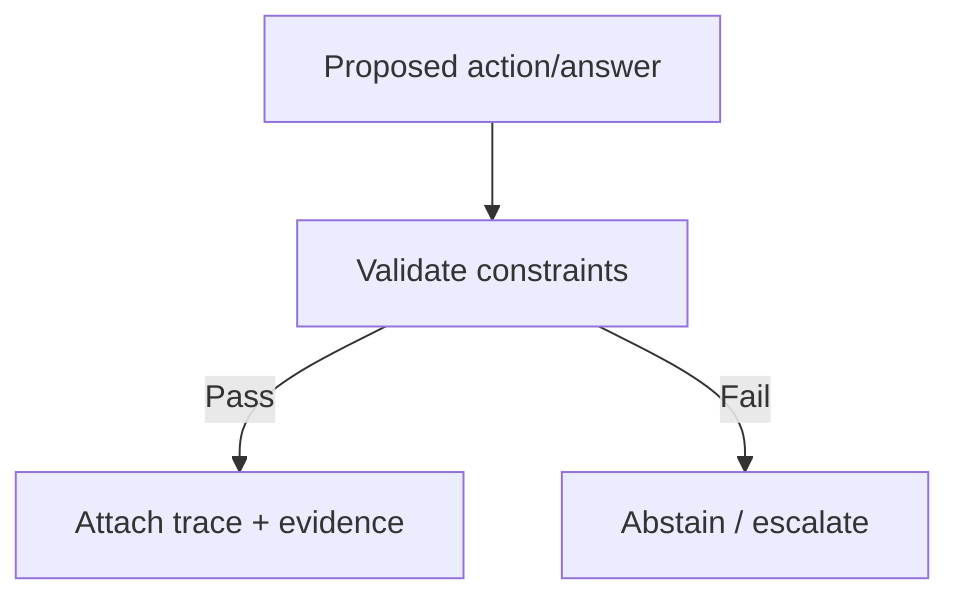

--8<-- "includes/quicknav.html"

# Governance Approach

Governance is not a PDF. Governance is an *enforced structure*.

## Two layers

1. **Interpretation layer**: policies, procedures, and allowed actions.
2. **Enforcement layer**: constraints that make policy violations technically impossible.

## Why this matters

A model can be persuaded.
A constraint cannot.

## Practical design choices

- Encode critical rules as constraints (e.g., SHACL-style validation).
- Keep facts/provenance immutable.
- Separate “hypothesis” from “fact” by design.
- Log every reasoning trace with source references.

Where this fits: [Methodology → Constraints](../methodology/constraints.md).
