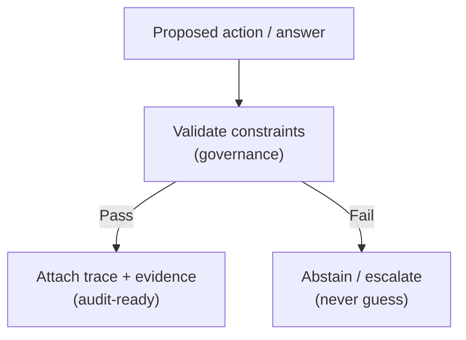

--8<-- "includes/quicknav.html"

# Governance Approach

  

    

      
Safety and compliance

      <h2 class="landing-title">Governance is not a PDF. Governance is enforced structure.</h2>
      

        In high-stakes systems, “please follow the policy” is not governance.
        Governance means the system is <strong>architecturally unable</strong> to produce invalid actions — and can show exactly why it refused.
      

      

        <a class="md-button md-button--primary" href="/methodology/constraints/">Constraints &amp; SHACL</a>
        <a class="md-button" href="/services/">Services</a>
        <a class="md-button" href="/case-studies/">Case studies</a>
      

      

        Enforcement layer
        Traceable refusals
        Immutable provenance
        Fact vs hypothesis separation
      

    

    

      
    

  

  <h2>Two layers of governance</h2>
  

    

      <h3>Interpretation layer</h3>
      
Policies, procedures, definitions of allowed actions, and escalation pathways. This is where humans specify intent.

    

    

      <h3>Enforcement layer</h3>
      
Constraints that make policy violations technically impossible (validation rules, permissions, invariants, and hard blocks).

    

    

      <h3>Audit layer</h3>
      
Trace logs, source provenance, and change history: who/what/when/why for every decision and refusal.

    

  

  <h2>Why constraints beat prompts</h2>
  

    
<strong>A model can be persuaded. A constraint cannot.</strong>

    
Prompt discipline is a useful interface pattern — but it is not a security boundary.

  

  <h2>Decision lifecycle (with refusal as a first-class outcome)</h2>

  <h2>Practical design choices</h2>
  

    

      <h3>Encode critical rules as constraints</h3>
      
Compliance, safety, and policy rules become validation logic (e.g., SHACL-style shapes) — not optional guidelines.

    

    

      <h3>Keep facts and provenance immutable</h3>
      
Facts don’t get overwritten. Source links remain stable so audits can reproduce outcomes.

    

    

      <h3>Separate fact from hypothesis</h3>
      
Predictions and simulations are labeled and isolated so they never masquerade as evidence.

    

  

  

    

      <h3>Log every trace</h3>
      
Every path and refusal is recorded with stable identifiers, timestamps, and sources.

    

    

      <h3>Make escalation explicit</h3>
      
When the system refuses, it should say what is missing and who can authorize exceptions.

    

    

      <h3>Measure governance coverage</h3>
      
Track which constraints are enforced, which are missing, and how often refusals occur.

    

  

  <h2>Where this fits</h2>
  

    

      <a class="md-button md-button--primary" href="/methodology/constraints/">Methodology → Constraints</a>
      <a class="md-button" href="operating-model/">Operating model</a>
      <a class="md-button" href="/services/">Services</a>
    

  

