--8<-- "includes/quicknav.html"

# Governance Approach

  

    

      
Safety and compliance

      <h2 class="landing-title">Governance is not a PDF. Governance is enforced structure.</h2>
      

        In high-stakes systems, “please follow the policy” is not governance.
        Governance means the system is <strong>architecturally unable</strong> to produce invalid actions — and can show exactly why it refused.
      

      

        <a class="md-button md-button--primary" href="/methodology/constraints/">Constraints &amp; SHACL</a>
        <a class="md-button" href="/services/">Services</a>
        <a class="md-button" href="/case-studies/">Case studies</a>
      

    

  

## Two layers of governance

  

    

      <h3>Interpretation layer</h3>
      
Policies, procedures, definitions of allowed actions, and escalation pathways. This is where humans specify intent.

    

    

      <h3>Enforcement layer</h3>
      
Constraints that make policy violations technically impossible (validation rules, permissions, invariants, and hard blocks).

    

    

      <h3>Audit layer</h3>
      
Trace logs, source provenance, and change history: who/what/when/why for every decision and refusal.

    

  

## Why constraints beat prompts

  

    
<strong>A model can be persuaded. A constraint cannot.</strong>

    
Prompt discipline is a useful interface pattern — but it is not a security boundary.

  

## Decision lifecycle (with refusal as a first-class outcome)

```mermaid
flowchart TB
%% Styles (brModel Standard)
classDef i fill:#D3D3D3,stroke-width:0px,color:#000;
classDef p fill:#B3D9FF,stroke-width:0px,color:#000;
classDef r fill:#FFFFB3,stroke-width:0px,color:#000;
classDef o fill:#C1F0C1,stroke-width:0px,color:#000;
classDef s fill:#FFB3B3,stroke-width:0px,color:#000;

I_Proposal(["📥 Proposed action / answer"]):::i

P_Policy("📜 Interpret policy (what is allowed)"):::p
P_Validate("🔒 Validate constraints (enforcement)"):::p
G_Check{"Valid?"}:::s

R_Evidence(["🔎 Evidence set (sources + provenance)"]):::r
R_Trace(["🧾 Trace log (who/what/why/when)"]):::r
O_Commit(["✅ Commit decision (audit-ready output)"]):::o

R_Refusal(["🛑 Refusal record (reason + missing evidence)"]):::r
P_Escalate("🧑‍⚖️ Escalate to owner (request exception)"):::p
O_Abstain(["🟨 Abstain safely (no guess)"]):::o

I_Proposal --> P_Policy --> P_Validate --> G_Check
G_Check -->|"yes"| R_Evidence --> R_Trace --> O_Commit
G_Check -->|"no"| R_Refusal --> P_Escalate --> O_Abstain

%% Clickable nodes
click P_Validate "/methodology/constraints/" "Constraints & SHACL"
click R_Trace "/methodology/llm-tool-rag/" "LLM + Tool + RAG"
click P_Escalate "/services/start/" "Start a conversation"
```

🔒 The key mechanism is a <strong>validity gate</strong>: proposals must pass enforceable constraints to become actions, and failures produce a first-class <strong>refusal record</strong> plus an explicit escalation path.

## Practical design choices

  

    

      <h3>Encode critical rules as constraints</h3>
      
Compliance, safety, and policy rules become validation logic (e.g., SHACL-style shapes) — not optional guidelines.

    

    

      <h3>Keep facts and provenance immutable</h3>
      
Facts don’t get overwritten. Source links remain stable so audits can reproduce outcomes.

    

    

      <h3>Separate fact from hypothesis</h3>
      
Predictions and simulations are labeled and isolated so they never masquerade as evidence.

    

  

  

    

      <h3>Log every trace</h3>
      
Every path and refusal is recorded with stable identifiers, timestamps, and sources.

    

    

      <h3>Make escalation explicit</h3>
      
When the system refuses, it should say what is missing and who can authorize exceptions.

    

    

      <h3>Measure governance coverage</h3>
      
Track which constraints are enforced, which are missing, and how often refusals occur.

    

  

## Where this fits

  

    

      <a class="md-button md-button--primary" href="/methodology/constraints/">Methodology → Constraints</a>
      <a class="md-button" href="/reasoners/operating-model/">Operating model</a>
      <a class="md-button" href="/services/">Services</a>
    

  

