--8<-- "includes/quicknav.html"

# Reasoners

	

		

			
Logic-first, glass-box delivery

			<h2 class="landing-title">We build decision-grade cognitive infrastructure.</h2>
			

				For high-stakes domains, “a plausible answer” is a liability.
				We help teams move from <strong>probabilistic demos</strong> to <strong>auditable systems</strong>: causal graph memory, enforceable governance, and reasoning traces you can inspect.
			

			

				<a class="md-button md-button--primary" href="/services/start/">Start a conversation</a>
				<a class="md-button" href="about/">About - Team - References</a>
				<a class="md-button" href="vision-2026/">Vision 2026</a>
				<a class="md-button" href="/methodology/">Methodology</a>
			

		

	

## What we build

	

		

			<h3>Structured memory for agents</h3>
			
A persistent memory layer grounded in entities, relations, provenance, and mechanisms — not just vector similarity.

		

		

			<h3>Glass-box reasoning traces</h3>
			
Every answer includes an auditable path: what nodes were used, why edges were traversed, and which sources support each step.

		

		

			<h3>Governance by design</h3>
			
Critical rules encoded as enforceable constraints (e.g., SHACL-style) so policy violations become technically impossible.

		

	

## One core, three reinforcing lanes

	

		

			<h3>Science (proof-of-quality)</h3>
			
We validate the hardest cases first. If the approach holds in biomedicine, it holds anywhere.

		

		

			<h3>Market (measurable ROI)</h3>
			
Commercial deployments that fund iteration and prove value under real operational constraints.

		

		

			<h3>Product (reusable building blocks)</h3>
			
We convert patterns into reusable architecture and tooling so the approach scales beyond one-off projects.

		

	

	

		<a class="md-button" href="vision-2026/">Read Vision 2026</a>
		<a class="md-button" href="operating-model/">Operating model</a>
		<a class="md-button" href="governance/">Governance approach</a>
	

## Where to start

	

		

			<h3>Evaluate fit</h3>
			
See what we do and what “good” looks like.

			

				<a class="md-button md-button--primary" href="/services/">Services</a>
				<a class="md-button" href="/case-studies/">Case studies</a>
			

		

		

			<h3>Understand the core</h3>
			
Go deeper into primitives, traces, and constraints.

			

				<a class="md-button md-button--primary" href="/methodology/">Methodology</a>
				<a class="md-button" href="/philosophy/">Philosophy</a>
			

		

		

			<h3>Read models</h3>
			
Public causal writing and reusable diagrams.

			

				<a class="md-button md-button--primary" href="/blog/">Blog</a>
			

		

	

### Reasoners map (pages and how they connect)

```mermaid
flowchart TB
%% Styles (brModel Standard)
classDef i fill:#D3D3D3,stroke-width:0px,color:#000;
classDef p fill:#B3D9FF,stroke-width:0px,color:#000;
classDef r fill:#FFFFB3,stroke-width:0px,color:#000;
classDef o fill:#C1F0C1,stroke-width:0px,color:#000;
classDef s fill:#FFB3B3,stroke-width:0px,color:#000;

S_Reader("👤 Reader"):::s
S_Buyer("🧑‍💼 Buyer"):::s
S_Engineer("🧑‍💻 Engineer"):::s

I_Intent(["🎯 What do you need right now?"]):::i

R_Overview("🤝 Reasoners — Overview"):::p
R_About("ℹ️ About (Team + References)"):::p
R_License("📄 brModel™ License"):::p
R_Vision("🗓️ Vision 2026"):::p
R_Ops("🛰️ Operating Model"):::p
R_Gov("🏛️ Governance Approach"):::p
R_FAQ("❓ FAQ"):::p
R_Terms("📜 Terms of Use"):::p

M_Method("📐 Methodology"):::p
M_Constraints("🔒 Constraints & SHACL"):::p
M_CGR("🧭 CausalGraphRAG"):::p

S_Services("🧰 Services"):::p
S_Start("📞 Start a conversation"):::p

S_Reader --> I_Intent
S_Buyer --> I_Intent
S_Engineer --> I_Intent

I_Intent --> R_Overview

R_Overview --> R_About
R_Overview --> R_Vision
R_Overview --> R_Ops
R_Overview --> R_Gov
R_Overview --> R_FAQ
R_Overview --> R_Terms
R_License --> M_Method
R_Terms --> R_License
R_Gov -. "enforcement" .-> M_Constraints
R_Ops -. "delivery patterns" .-> S_Services
R_Vision -. "why / strategy" .-> R_Ops
R_Vision -. "safety" .-> R_Gov

M_Method --> M_CGR
M_Method --> M_Constraints

S_Services --> S_Start
R_About --> S_Start

%% Clickable nodes
click R_Overview "/reasoners/" "Reasoners Overview"
click R_About "/reasoners/about/" "About"
click R_License "/reasoners/license/" "brModel License"
click R_Vision "/reasoners/vision-2026/" "Vision 2026"
click R_Ops "/reasoners/operating-model/" "Operating Model"
click R_Gov "/reasoners/governance/" "Governance"
click R_FAQ "/reasoners/faq/" "FAQ"
click R_Terms "/reasoners/terms/" "Terms"

click M_Method "/methodology/" "Methodology"
click M_CGR "/methodology/causalgraphrag/" "CausalGraphRAG"
click M_Constraints "/methodology/constraints/" "Constraints & SHACL"

click S_Services "/services/" "Services"
click S_Start "/services/start/" "Start"
```

🧭 This map shows how the <strong>Reasoners</strong> pages connect: overview → operating model → governance and terms, with direct links into the <strong>Methodology</strong> primitives that make enforcement and traces real.

    

