--8<-- "includes/quicknav.html"

# Operating Model

	

		

			
Delivery system

			<h2 class="landing-title">A repeatable way to turn AI demos into decision-grade systems.</h2>
			

				We work backwards from the failure mode that matters most: in high-stakes domains, a confident fabrication is not a minor bug — it’s an unacceptable risk.
				The operating model below is designed to reduce that risk quickly and measurably.
			

			

				<a class="md-button md-button--primary" href="/services/start/">Start a conversation</a>
				<a class="md-button" href="/services/">Services</a>
				<a class="md-button" href="/methodology/">Methodology</a>
			

		

	

## The engagement loop

```mermaid
flowchart TB
%% Styles (brModel Standard)
classDef i fill:#D3D3D3,stroke-width:0px,color:#000;
classDef p fill:#B3D9FF,stroke-width:0px,color:#000;
classDef r fill:#FFFFB3,stroke-width:0px,color:#000;
classDef o fill:#C1F0C1,stroke-width:0px,color:#000;
classDef s fill:#FFB3B3,stroke-width:0px,color:#000;

S_Client("🏢 Client team"):::s
S_Reasoners("🤝 Reasoners"):::s

I_Goal(["🎯 Decision to support + unacceptable errors + constraints"]):::i

P_Clarify("1) Clarify the decision"):::p
P_Map("2) Map the domain"):::p
P_Gov("3) Encode governance"):::p
P_Build("4) Build the memory layer"):::p
P_Prove("5) Prove it works"):::p
P_Ops("6) Operationalize"):::p

R_Brief(["🧾 Decision brief"]):::r
R_Model(["🧩 Domain model"]):::r
R_Constraints(["🔒 Constraint set"]):::r
R_Memory(["🧠 Graph memory + traces"]):::r
R_Eval(["🧪 Evaluation suite"]):::r
R_Runbook(["📕 Runbook"]):::r

O_System(["✅ Decision-grade system (grounded + governed)"]):::o

S_Client --> I_Goal
S_Reasoners --> I_Goal

I_Goal --> P_Clarify --> R_Brief --> P_Map --> R_Model --> P_Gov --> R_Constraints --> P_Build --> R_Memory --> P_Prove --> R_Eval --> P_Ops --> R_Runbook --> O_System

O_System -. "monitoring + change" .-> P_Map

%% Clickable nodes
click P_Gov "/reasoners/governance/" "Governance"
click R_Constraints "/methodology/constraints/" "Constraints & SHACL"
click P_Build "/methodology/causalgraphrag/" "CausalGraphRAG"
click R_Memory "/methodology/llm-tool-rag/" "LLM + Tool + RAG"
```

	

		

			<h3>1) Clarify the decision</h3>
			
Define the outcome, the unacceptable error modes, and the constraints that must never be violated.

		

		

			<h3>2) Map the domain</h3>
			
Identify entities, processes, mechanisms, and provenance — the minimum semantic skeleton the system must “know”.

		

		

			<h3>3) Encode governance</h3>
			
Turn policy into enforceable rules: constraints, allowed actions, escalation paths, and audit requirements.

		

	

	

		

			<h3>4) Build the memory layer</h3>
			
Implement graph memory, connect sources, and produce reasoning traces with stable identifiers and provenance links.

		

		

			<h3>5) Prove it works</h3>
			
Counterfactual tests, red teaming, and monitoring. If it can’t abstain reliably, it’s not ready.

		

		

			<h3>6) Operationalize</h3>
			
Runbooks, ownership, change management, and governance coverage tracking as the domain evolves.

		

	

## What we optimize for

	

		<ul>
			<li><strong>Traceability</strong> over fluency</li>
			<li><strong>Abstention</strong> over improvisation</li>
			<li><strong>Constraints</strong> over prompt discipline</li>
			<li><strong>Durable semantics</strong> over model loyalty</li>
		</ul>
		
Models change. Your logic and governance must not.

	

## Typical artifacts (deliverables)

```mermaid
flowchart TB
%% Styles (brModel Standard)
classDef i fill:#D3D3D3,stroke-width:0px,color:#000;
classDef p fill:#B3D9FF,stroke-width:0px,color:#000;
classDef r fill:#FFFFB3,stroke-width:0px,color:#000;
classDef o fill:#C1F0C1,stroke-width:0px,color:#000;
classDef s fill:#FFB3B3,stroke-width:0px,color:#000;

I_Sources(["📥 Sources (files + DBs + policies)"]):::i

P_Ingest("Ingest + standardize"):::p
R_Sheet(["🟨 brSheet (Input matrix)"]):::r

P_Model("Model + compile"):::p
R_Statement(["🟨 brStatement (Executable causal atom)"]):::r
R_CD(["🟨 brCD (collection of statements)"]):::r

P_Compute("Compute + persist"):::p
R_Graph(["🟨 brGraph (Live graph state)"]):::r

P_View("Project views"):::p
R_Diagram(["🟨 brDiagram (Mermaid / yFiles)"]):::r

P_Narrate("Narrate for humans"):::p
R_Report(["🟨 brReport (Structured narrative)"]):::r

O_Audit(["✅ Audit-ready delivery (traceable + governed)"]):::o

I_Sources --> P_Ingest --> R_Sheet --> P_Model --> R_Statement --> R_CD --> P_Compute --> R_Graph
R_Graph --> P_View --> R_Diagram --> O_Audit
R_Graph --> P_Narrate --> R_Report --> O_Audit

%% Clickable nodes
click R_Diagram "/diagrams/" "Diagram Gallery"
click R_Report "/services/epistemic-audit/" "Epistemic Audit"
click R_Graph "/methodology/property-and-knowledge-graphs/" "Property-Knowledge Graph"
click R_Statement "/methodology/core-primitives/" "Core Primitives"
```

	

		

			<h3>Decision brief</h3>
			
Outcome, unacceptable errors, constraints, and measurement plan.

		

		

			<h3>Domain model</h3>
			
Core entities/processes and their causal relations with source provenance.

		

		

			<h3>Governance package</h3>
			
Constraints, escalation rules, and an audit trail design.

		

	

	

		

			<h3>Reasoning traces</h3>
			
Explainable paths (A → B → C) that can be inspected and challenged.

		

		

			<h3>Evaluation suite</h3>
			
Counterfactual tests and red-team cases that validate abstention and compliance behavior.

		

		

			<h3>Runbook</h3>
			
Operational procedures: monitoring, change control, and governance coverage tracking.

		

	

## Where this connects

	

		

			<a class="md-button" href="/services/">Services</a>
			<a class="md-button" href="/reasoners/governance/">Governance approach</a>
			<a class="md-button" href="/methodology/">Methodology</a>
		

	

