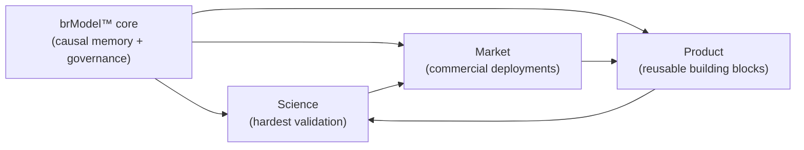
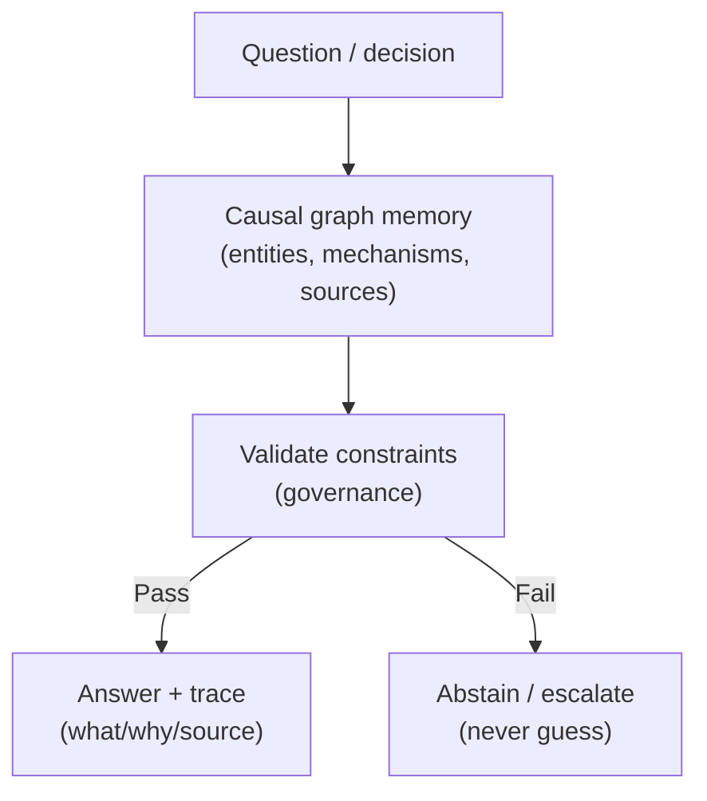

--8<-- "includes/quicknav.html"

# Vision 2026

	

		

			
Public strategic narrative

			<h2 class="landing-title">From data to understanding: science-grade rigor, business-grade delivery.</h2>
			

				Generative AI is impressive — but in critical workflows it fails in the worst possible way: it fabricates.
				Vision 2026 is our plan to build <strong>decision-grade cognitive infrastructure</strong>: causal memory, governance, and auditable reasoning.
			

			

				<a class="md-button md-button--primary" href="../services/start/">Start a conversation</a>
				<a class="md-button" href="../methodology/">Open methodology</a>
				<a class="md-button" href="governance/">Governance approach</a>
			

			

				Abstain over improvise
				Auditable traces
				Causal paths
				Enforced constraints
			

		

		

			
		

	

	<h2>The diagnosis</h2>
	

		
<strong>The industry is stuck.</strong> Models can write and summarize, but when evidence is missing they often produce a confident guess. In medicine, finance, and law that failure mode is unacceptable.

		
A safe system must be able to refuse. It must also show its work.

	

	<h2>The goal</h2>
	

		

			<h3>Truth infrastructure</h3>
			
A memory + logic layer that makes answers grounded and inspectable — not just fluent.

		

		

			<h3>Glass-box reasoning</h3>
			
Every output ships with an evidence trail and a causal path that can be audited.

		

		

			<h3>Governance by design</h3>
			
Rules are encoded as constraints, so unsafe or non-compliant actions are technically blocked.

		

	

	<h2>One core, three reinforcing lanes</h2>
	
The strategy is deliberately simple: we develop one shared core (brModel™) and apply it across three lanes that reinforce each other.

	

		

			<h3>Lane A: Science (proof-of-quality)</h3>
			
We test where error is most expensive and structure is most complex. If the approach holds here, it holds anywhere.

		

		

			<h3>Lane B: Market (ROI + constraints)</h3>
			
Commercial deployments force real measurement: latency, trace quality, governance coverage, and operational stability.

		

		

			<h3>Lane C: Product (scale)</h3>
			
We convert repeated patterns into reusable components so the system can be adopted beyond a single team or project.

		

	

	<h2>How we explain it without jargon</h2>
	

		
Think of an AI system as a brilliant new hire with two problems:

		<ul>
			<li>It forgets quickly.</li>
			<li>It sometimes improvises under pressure.</li>
		</ul>
		
Standard RAG gives the new hire more documents to skim. Our approach gives it a <strong>map</strong>: a causal graph of your domain, with provenance and enforceable rules.

	

	<h2>What a client gets</h2>
	

		

			<h3>Confidence</h3>
			
Answers backed by explicit causal paths and source provenance — not pattern-matched paragraphs.

		

		

			<h3>Evidence</h3>
			
For every claim: traceable steps you can inspect, audit, and challenge.

		

		

			<h3>Safety</h3>
			
Hard rules that prevent invalid recommendations (e.g., compliance, medical contraindications, policy constraints).

		

	

	

		<a class="md-button" href="operating-model/">Operating model</a>
		<a class="md-button" href="../services/">Services</a>
	

