--8<-- "includes/quicknav.html"

    

# Vision 2026

	

		

			
Public strategic narrative

			<h2 class="landing-title">From data to understanding: science-grade rigor, business-grade delivery.</h2>
			

				Generative AI is impressive — but in critical workflows it fails in the worst possible way: it fabricates.
				Vision 2026 is our plan to build <strong>decision-grade cognitive infrastructure</strong>: causal memory, governance, and auditable reasoning.
			

			

				<a class="md-button md-button--primary" href="/services/start/">Start a conversation</a>
				<a class="md-button" href="/methodology/">Open methodology</a>
				<a class="md-button" href="/reasoners/governance/">Governance approach</a>
			

		

	

## The diagnosis

	

		
<strong>The industry is stuck.</strong> Models can write and summarize, but when evidence is missing they often produce a confident guess. In medicine, finance, and law that failure mode is unacceptable.

		
A safe system must be able to refuse. It must also show its work.

	

## The goal

	

		

			<h3>Truth infrastructure</h3>
			
A memory + logic layer that makes answers grounded and inspectable — not just fluent.

		

		

			<h3>Glass-box reasoning</h3>
			
Every output ships with an evidence trail and a causal path that can be audited.

		

		

			<h3>Governance by design</h3>
			
Rules are encoded as constraints, so unsafe or non-compliant actions are technically blocked.

		

	

## One core, three reinforcing lanes

```mermaid
flowchart TB
%% Styles (brModel Standard)
classDef i fill:#D3D3D3,stroke-width:0px,color:#000;
classDef p fill:#B3D9FF,stroke-width:0px,color:#000;
classDef r fill:#FFFFB3,stroke-width:0px,color:#000;
classDef o fill:#C1F0C1,stroke-width:0px,color:#000;
classDef s fill:#FFB3B3,stroke-width:0px,color:#000;

I_Core(["🧠 brModel™ core (causal memory + governance)"]):::r

P_Science("🧪 Science (hardest validation)"):::p
O_Quality(["✅ Proof-of-quality (counterfactuals, audits)"]):::o

P_Market("🏭 Market (real deployments)"):::p
O_ROI(["📈 Measurable value (ROI + reliability)"]):::o

P_Product("🧩 Product (reusable building blocks)"):::p
O_Scale(["🔁 Reusable patterns (components + standards)"]):::o

I_Core --> P_Science --> O_Quality
I_Core --> P_Market --> O_ROI
I_Core --> P_Product --> O_Scale

O_Quality -. "trust" .-> P_Market
O_ROI -. "funds iteration" .-> P_Product
O_Scale -. "improves rigor" .-> P_Science

%% Clickable nodes
click I_Core "/methodology/" "Methodology"
click P_Science "/case-studies/biomedicine/" "Biomedicine"
click P_Market "/services/" "Services"
click P_Product "/methodology/core-primitives/" "Core Primitives"
```

	
The strategy is deliberately simple: we develop one shared core (brModel™) and apply it across three lanes that reinforce each other.

🧠 This diagram is the strategy engine: one shared <strong>brModel™ core</strong> is validated in science, proven in deployments, and productized into reusable patterns — each lane strengthening the others.

	

		

			<h3>Lane A: Science (proof-of-quality)</h3>
			
We test where error is most expensive and structure is most complex. If the approach holds here, it holds anywhere.

		

		

			<h3>Lane B: Market (ROI + constraints)</h3>
			
Commercial deployments force real measurement: latency, trace quality, governance coverage, and operational stability.

		

		

			<h3>Lane C: Product (scale)</h3>
			
We convert repeated patterns into reusable components so the system can be adopted beyond a single team or project.

		

	

## How we explain it without jargon

	

		
Think of an AI system as a brilliant new hire with two problems:

		<ul>
			<li>It forgets quickly.</li>
			<li>It sometimes improvises under pressure.</li>
		</ul>
		
Standard RAG gives the new hire more documents to skim. Our approach gives it a <strong>map</strong>: a causal graph of your domain, with provenance and enforceable rules.

	

🧭 The “no jargon” version: instead of skimming documents, the system retrieves <strong>causal memory</strong>, checks <strong>constraints</strong>, then ships an <strong>audit-ready trace</strong> — or refuses when it can’t justify the decision.

```mermaid
flowchart TB
%% Styles (brModel Standard)
classDef i fill:#D3D3D3,stroke-width:0px,color:#000;
classDef p fill:#B3D9FF,stroke-width:0px,color:#000;
classDef r fill:#FFFFB3,stroke-width:0px,color:#000;
classDef o fill:#C1F0C1,stroke-width:0px,color:#000;
classDef s fill:#FFB3B3,stroke-width:0px,color:#000;

S_User("👤 Human decision-maker"):::s
I_Q(["📥 Question / decision + constraints context"]):::i

P_Retrieve("🧭 Retrieve causal memory"):::p
R_Graph(["🧠 Graph memory (entities + mechanisms + sources)"]):::r

P_Validate("🔒 Validate constraints"):::p
G_Pass{"Pass?"}:::s

R_Trace(["🧾 Reasoning trace (what/why/source)"]):::r
O_Answer(["✅ Answer / action (grounded + auditable)"]):::o

O_Refuse(["🛑 Refuse / escalate (never guess)"]):::o
R_Missing(["📌 What is missing? (which evidence / who can approve)"]):::r

S_User --> I_Q --> P_Retrieve --> R_Graph --> P_Validate --> G_Pass
G_Pass -->|"yes"| R_Trace --> O_Answer
G_Pass -->|"no"| R_Missing --> O_Refuse

%% Clickable nodes
click P_Retrieve "/methodology/causalgraphrag/" "CausalGraphRAG"
click P_Validate "/methodology/constraints/" "Constraints & SHACL"
click R_Trace "/methodology/llm-tool-rag/" "LLM + Tool + RAG"
click O_Refuse "/reasoners/governance/" "Governance"
```

## What a client gets

	

		

			<h3>Confidence</h3>
			
Answers backed by explicit causal paths and source provenance — not pattern-matched paragraphs.

		

		

			<h3>Evidence</h3>
			
For every claim: traceable steps you can inspect, audit, and challenge.

		

		

			<h3>Safety</h3>
			
Hard rules that prevent invalid recommendations (e.g., compliance, medical contraindications, policy constraints).

		

	

	

		<a class="md-button" href="/reasoners/operating-model/">Operating model</a>
		<a class="md-button" href="/services/">Services</a>
	

