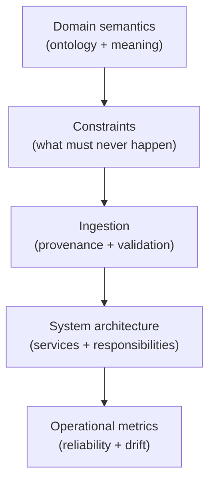
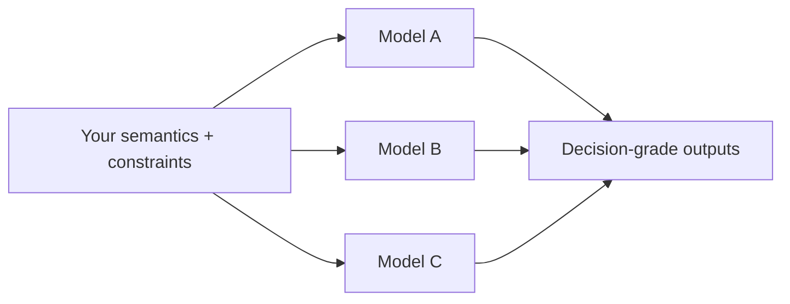

--8<-- "includes/quicknav.html"

# Architecture Blueprint

	

		

			
Services → design

			<h2 class="landing-title">Turn domain knowledge into a system you can own.</h2>
			

				The Blueprint phase converts scattered expertise into durable semantics, enforceable constraints, and a reference architecture.
				The goal is straightforward: make reliability a property of the system, not a hope inside prompts.
			

			

				<a class="md-button md-button--primary" href="start/">Start a Conversation</a>
				<a class="md-button" href="implementation/">Implementation</a>
				<a class="md-button" href="../methodology/core-primitives/">Core primitives</a>
			

		

		

			
		

	

	<h2>Outputs</h2>
	

		

			<h3>Domain model</h3>
			
Concepts + relations that describe what exists, what happens, and what matters in decisions.

		

		

			<h3>Constraint model</h3>
			
Rules the system must enforce: what must never happen, what must be proven, what must be escalated.

		

		

			<h3>Ingestion strategy</h3>
			
How facts and sources enter: provenance, versioning, extraction methods, and validation gates.

		

		

			<h3>Reference architecture</h3>
			
Components and responsibilities: retrieval, traversal, constraint gate, trace store, evaluation, monitoring.

		

	

	<h2>Diagram: blueprint layers</h2>

	<h2>Why clients like this phase</h2>
	

		
<strong>Because it reduces vendor lock-in.</strong>

		
You own the semantics and constraints even when models change.

	

	<h2>What happens next</h2>
	

		

			The Blueprint becomes the build plan for a glass-box implementation: enforceable gates, traces, monitoring, and a team-ready handover.
		

		

			<a class="md-button md-button--primary" href="implementation/">Implementation</a>
			<a class="md-button" href="partnership/">Ongoing Partnership</a>
		

	

