--8<-- "includes/quicknav.html"

# Architecture Blueprint

	

		

			
Services → design

			<h2 class="landing-title">Turn domain knowledge into a system you can own.</h2>
			

				The Blueprint phase converts scattered expertise into durable semantics, enforceable constraints, and a reference architecture.
				The goal is straightforward: make reliability a property of the system, not a hope inside prompts.
			

			

				<a class="md-button md-button--primary" href="/services/start/">Start a Conversation</a>
				<a class="md-button" href="/services/implementation/">Implementation</a>
				<a class="md-button" href="/methodology/core-primitives/">Core primitives</a>
			

		

	

## Outputs

	

		

			<h3>Domain model</h3>
			
Concepts + relations that describe what exists, what happens, and what matters in decisions.

		

		

			<h3>Constraint model</h3>
			
Rules the system must enforce: what must never happen, what must be proven, what must be escalated.

		

		

			<h3>Ingestion strategy</h3>
			
How facts and sources enter: provenance, versioning, extraction methods, and validation gates.

		

		

			<h3>Reference architecture</h3>
			
Components and responsibilities: retrieval, traversal, constraint gate, trace store, evaluation, monitoring.

		

		

			<h3>Trace schema</h3>
			
What gets stored for every decision: path, evidence, rules applied, and the exact reason for answer vs abstain.

		

		

			<h3>Measurement &amp; gates</h3>
			
Operational metrics and validation gates that make reliability measurable: regressions, drift, and policy violations become visible.

		

	

    

## Diagram: blueprint layers

```mermaid
flowchart TB
%% Styles (brModel Standard)
classDef i fill:#D3D3D3,stroke-width:0px,color:#000;
classDef p fill:#B3D9FF,stroke-width:0px,color:#000;
classDef r fill:#FFFFB3,stroke-width:0px,color:#000;
classDef o fill:#C1F0C1,stroke-width:0px,color:#000;
classDef s fill:#FFB3B3,stroke-width:0px,color:#000;

R_Domain(["🧩 Domain semantics<br>(ontology + meaning)"]):::r
G_Sem{"Semantics sufficient?"}:::s
R_Constr(["🔒 Constraints<br>(what must never happen)"]):::r
G_Constr{"Constraints sufficient?"}:::s
P_Ingest("📥 Ingestion design"):::p
R_Prov(["🧾 Provenance + validation gates"]):::r
G_Prov{"Evidence replayable?"}:::s
P_Arch("🗺️ System architecture"):::p
R_Roles(["Responsibilities: retrieval, traversal, gate, trace store"]):::r
G_Arch{"Gates + traces complete?"}:::s
P_Ops("📊 Operations"):::p
O_Metrics(["✅ Metrics + go/no-go gates<br>(reliability, drift, violations)"]):::o

S_Work(["🛑 Workshop / modeling iteration"]):::s

R_Domain --> G_Sem
G_Sem -->|"no"| S_Work --> R_Domain
G_Sem -->|"yes"| R_Constr --> G_Constr

G_Constr -->|"no"| S_Work --> R_Constr
G_Constr -->|"yes"| P_Ingest --> R_Prov --> G_Prov

G_Prov -->|"no"| S_Work --> P_Ingest
G_Prov -->|"yes"| P_Arch --> R_Roles --> G_Arch

G_Arch -->|"no"| S_Work --> P_Arch
G_Arch -->|"yes"| P_Ops --> O_Metrics

%% Clickable nodes
click R_Domain "/methodology/core-primitives/" "Core primitives"
click R_Constr "/methodology/constraints/" "Constraints & SHACL"
click R_Prov "/methodology/llm-tool-rag/" "LLM + Tool + RAG"
click R_Roles "/methodology/causalgraphrag/" "CausalGraphRAG"
```

🚦 This diagram makes the Blueprint <strong>iterative and gated</strong>: each layer has a decision point (semantics sufficient? constraints sufficient? evidence replayable? gates + traces complete?). If not, we loop into focused modeling work instead of pretending we’re ready to build.

## Why clients like this phase

	

		
<strong>Because it reduces vendor lock-in.</strong>

		
You own the semantics and constraints even when models change.

	

🔠This diagram is the anti-lock-in mechanism: you can swap models, but you keep <strong>🧩 semantics</strong> and <strong>🔒 constraints</strong> stable — so outputs remain <strong>✅ governed</strong> and comparable across model churn.

```mermaid
flowchart LR
%% Styles (brModel Standard)
classDef i fill:#D3D3D3,stroke-width:0px,color:#000;
classDef p fill:#B3D9FF,stroke-width:0px,color:#000;
classDef r fill:#FFFFB3,stroke-width:0px,color:#000;
classDef o fill:#C1F0C1,stroke-width:0px,color:#000;
classDef s fill:#FFB3B3,stroke-width:0px,color:#000;

R_SEM(["🧩 Your semantics + 🔒 constraints"]):::r
P_M1("🧠 Model A"):::p
P_M2("🧠 Model B"):::p
P_M3("🧠 Model C"):::p
O_Out(["✅ Decision-grade outputs<br>(traceable + governed)"]):::o

R_SEM --> P_M1 --> O_Out
R_SEM --> P_M2 --> O_Out
R_SEM --> P_M3 --> O_Out

%% Clickable nodes
click R_SEM "/methodology/" "Methodology"
click O_Out "/reasoners/governance/" "Governance approach"
```

## What happens next

	

		

			The Blueprint becomes the build plan for a glass-box implementation: enforceable gates, traces, monitoring, and a team-ready handover.
		

		

			<a class="md-button md-button--primary" href="/services/implementation/">Implementation</a>
			<a class="md-button" href="/services/partnership/">Ongoing Partnership</a>
		

	

