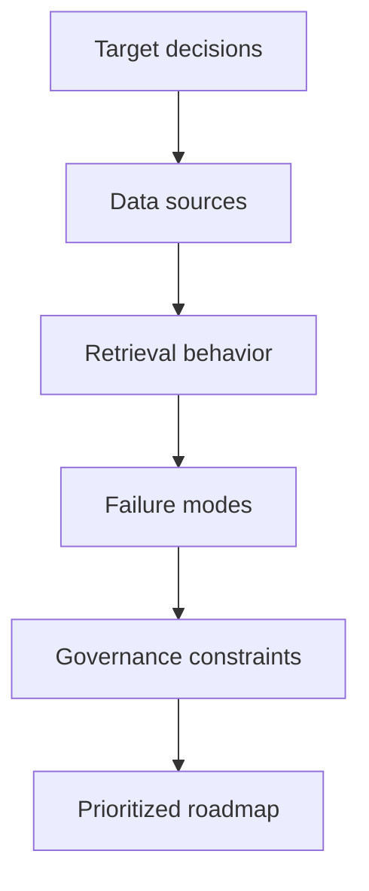
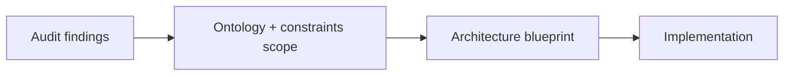

--8<-- "includes/quicknav.html"

# Epistemic Audit

	

		

			
Services → diagnosis

			<h2 class="landing-title">An Epistemic Audit tells you what will go wrong before it does.</h2>
			

				The core question is simple:
				<strong>Are you structurally ready to deploy agentic AI without unacceptable hallucination risk?</strong>
				We answer it with evidence, not optimism.
			

			

				<a class="md-button md-button--primary" href="start/">Start a Conversation</a>
				<a class="md-button" href="blueprint/">Architecture Blueprint</a>
				<a class="md-button" href="../methodology/llm-tool-rag/">Baseline stack (LLM+Tool+RAG)</a>
			

		

		

			
		

	

	<h2>What we assess</h2>
	

		

			<h3>Data reality</h3>
			
PDFs, SQL, spreadsheets, KBs, tickets, wikis — and the mismatch between them.

		

		

			<h3>Failure modes</h3>
			
Fabrications, drift, inconsistent answers, policy edge cases, silent uncertainty.

		

		

			<h3>Ontology gaps</h3>
			
Missing concepts and relations that cause retrieval to return “relevant” but unusable evidence.

		

		

			<h3>Governance requirements</h3>
			
Audit obligations, traceability, constraint needs, approval workflows, and abstention rules.

		

	

	<h2>Diagram: what an audit maps</h2>

	<h2>Deliverables (decision-grade, not slide-grade)</h2>
	

		
<h3>Readiness report</h3>
A candid assessment of reliability, risk, and what must change before production.

		
<h3>Prioritized risks</h3>
Top failure modes with severity, likelihood, and concrete mitigations.

		
<h3>Quick wins</h3>
Low-effort fixes that reduce hallucinations fast (schema, provenance, constraints, evaluation).

		
<h3>Roadmap</h3>
Staged plan with measurable milestones and explicit “go/no-go” gates.

	

	<h2>Diagram: from audit to blueprint</h2>

	<h2>Best fit</h2>
	

		<ul>
			<li>Hallucination is unacceptable (legal, medical, financial, safety-critical).</li>
			<li>Audits or compliance matter.</li>
			<li>Your data is messy and multi-source.</li>
			<li>You need a plan that survives model churn.</li>
		</ul>
		
<a class="md-button md-button--primary" href="start/">Start a Conversation</a>

	

