--8<-- "includes/quicknav.html"

# Epistemic Audit

	

		

			
Services → diagnosis

			<h2 class="landing-title">An Epistemic Audit tells you what will go wrong before it does.</h2>
			

				The core question is simple:
				<strong>Are you structurally ready to deploy agentic AI without unacceptable hallucination risk?</strong>
				We answer it with evidence, not optimism.
			

			

				<a class="md-button md-button--primary" href="start/">Start a Conversation</a>
				<a class="md-button" href="blueprint/">Architecture Blueprint</a>
				<a class="md-button" href="/methodology/llm-tool-rag/">Baseline stack (LLM+Tool+RAG)</a>
			

		

	

## What we assess

	

		

			<h3>Data reality</h3>
			
PDFs, SQL, spreadsheets, KBs, tickets, wikis — and the mismatch between them.

		

		

			<h3>Failure modes</h3>
			
Fabrications, drift, inconsistent answers, policy edge cases, silent uncertainty.

		

		

			<h3>Ontology gaps</h3>
			
Missing concepts and relations that cause retrieval to return “relevant†but unusable evidence.

		

		

			<h3>Decision boundaries</h3>
			
What must never be wrong, what can be approximate, and where abstention and escalation must trigger.

		

		

			<h3>Governance requirements</h3>
			
Audit obligations, traceability, constraint needs, approval workflows, and abstention rules.

		

		

			<h3>Evaluation reality</h3>
			
What you can measure today, what you’re not measuring, and how to build go/no-go gates that survive model churn.

		

	

    

## Diagram: what an audit maps

```mermaid
flowchart TB
%% Styles (brModel Standard)
classDef i fill:#D3D3D3,stroke-width:0px,color:#000;
classDef p fill:#B3D9FF,stroke-width:0px,color:#000;
classDef r fill:#FFFFB3,stroke-width:0px,color:#000;
classDef o fill:#C1F0C1,stroke-width:0px,color:#000;
classDef s fill:#FFB3B3,stroke-width:0px,color:#000;

I_Dec(["🎯 Target decision(s) + unacceptable errors"]):::i
I_Data(["📥 Data reality (PDF, SQL, KB, policies)"]):::i

P_Test("🧪 Probe retrieval and reasoning"):::p
R_Beh(["🔎 Behavior map (what it retrieves, what it misses)"]):::r

P_Fail("⚠️ Elicit failure modes"):::p
R_Modes(["🧾 Failure taxonomy (hallucination, drift, policy edges)"]):::r

P_Gov("🔒 Derive governance requirements"):::p
R_Constr(["🔒 Constraint scope + escalation rules"]):::r

P_Eval("📏 Define evaluation + go/no-go gates"):::p
R_Meas(["📊 Measurement plan (metrics, tests, drift signals)"]):::r

P_Road("🗺️ Prioritize into staged roadmap"):::p
O_Out(["✅ Audit outputs (report + roadmap + next step)"]):::o

I_Dec --> P_Test
I_Data --> P_Test
P_Test --> R_Beh --> P_Fail --> R_Modes --> P_Gov --> R_Constr --> P_Eval --> R_Meas --> P_Road --> O_Out

%% Clickable nodes
click P_Gov "/methodology/constraints/" "Constraints & SHACL"
click P_Test "/methodology/llm-tool-rag/" "Baseline stack"
click P_Eval "/reasoners/governance/" "Governance approach"
```

🔠This diagram shows what an <strong>Epistemic Audit</strong> actually produces: it starts from <strong>🯠decisions + unacceptable errors</strong>, tests real behavior against messy <strong>📥 data reality</strong>, then turns failures into <strong>🔒 governance requirements</strong>, measurable <strong>📠gates</strong>, and a staged <strong>🗺️ roadmap</strong>.

## Deliverables (decision-grade, not slide-grade)

	

		
<h3>Readiness report</h3>
A candid assessment of reliability, risk, and what must change before production.

		
<h3>Prioritized risks</h3>
Top failure modes with severity, likelihood, and concrete mitigations.

		
<h3>Quick wins</h3>
Low-effort fixes that reduce hallucinations fast (schema, provenance, constraints, evaluation).

		
<h3>Roadmap</h3>
Staged plan with measurable milestones and explicit “go/no-go†gates.

		
<h3>Constraint scope</h3>
A first-pass map of the rules that must be enforceable, plus the highest-risk violations to block first.

		
<h3>Evaluation plan</h3>
A concrete test strategy: what to measure, how to red-team, and how to detect drift and regression over time.

	

## Diagram: from audit to blueprint

```mermaid
flowchart TB
%% Styles (brModel Standard)
classDef i fill:#D3D3D3,stroke-width:0px,color:#000;
classDef p fill:#B3D9FF,stroke-width:0px,color:#000;
classDef r fill:#FFFFB3,stroke-width:0px,color:#000;
classDef o fill:#C1F0C1,stroke-width:0px,color:#000;
classDef s fill:#FFB3B3,stroke-width:0px,color:#000;

P_Audit("🔎 Audit"):::p
R_Find(["🧾 Findings: risks + gaps + priorities"]):::r
R_Scope(["🧩 Scope: ontology + constraints + trace needs"]):::r
P_Blue("📐 Blueprint"):::p
R_Arch(["📐 Reference architecture + gates"]):::r
P_Impl("🧑‍💻 Implementation"):::p
O_Ship(["✅ Governed build in production"]):::o

P_Audit --> R_Find --> R_Scope --> P_Blue --> R_Arch --> P_Impl --> O_Ship

%% Clickable nodes
click P_Blue "/services/blueprint/" "Architecture Blueprint"
click P_Impl "/services/implementation/" "Implementation"
click R_Scope "/methodology/core-primitives/" "Core primitives"
```

🧭 The audit is not an end state: it produces a <strong>scope</strong> (what must be modeled and enforced), which becomes the <strong>Blueprint</strong>, which becomes a buildable <strong>Implementation</strong>. This is how we avoid “pilot purgatory”.

## Best fit

	

		<ul>
			<li>Hallucination is unacceptable (legal, medical, financial, safety-critical).</li>
			<li>Audits or compliance matter.</li>
			<li>Your data is messy and multi-source.</li>
			<li>You need a plan that survives model churn.</li>
		</ul>
		
<a class="md-button md-button--primary" href="start/">Start a Conversation</a>

	

