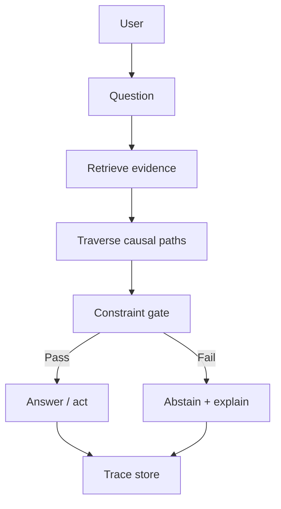
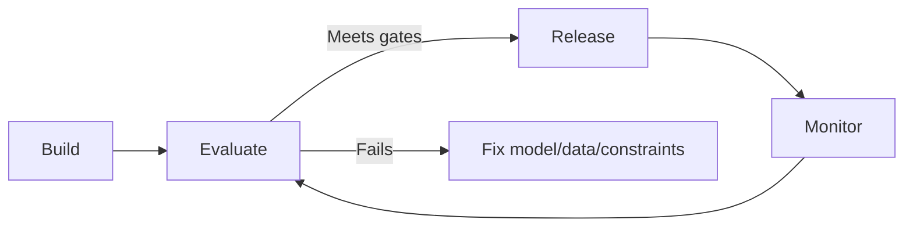

--8<-- "includes/quicknav.html"

# Implementation

	

		

			
Services → execution

			<h2 class="landing-title">Build the glass-box stack: constraints, traces, and measurable reliability.</h2>
			

				Implementation is where the Blueprint becomes an operational system.
				The key deliverable is not “a chatbot” — it’s a governed memory layer that decides when to answer, when to abstain, and how to prove why.
			

			

				<a class="md-button md-button--primary" href="start.md">Start a Conversation</a>
				<a class="md-button" href="blueprint.md">Architecture Blueprint</a>
				<a class="md-button" href="../methodology/brcausalgraphrag.md">brCausalGraphRAG</a>
			

		

		

			
		

	

	<h2>Typical components</h2>
	

		
<h3>Graph memory + provenance</h3>
Claims as objects with sources, versions, and scope.

		
<h3>Retrieval + traversal services</h3>
Similarity for discovery; causal traversal for mechanistic paths.

		
<h3>Constraint validation</h3>
Enforce policies and safety rules in a gate the model cannot bypass.

		
<h3>Trace generation</h3>
Store machine-verifiable artifacts: evidence, rules applied, decisions, and memory writes.

		
<h3>Operational monitoring</h3>
Reliability metrics, drift detection, evaluation harnesses, and incident playbooks.

		
<h3>Team handover</h3>
Documentation, training, and measured success criteria.

	

	<h2>Diagram: the glass-box stack</h2>

	<h2>How we ship (so reliability is observable)</h2>
	

		
<strong>We treat governance and evaluation as first-class features.</strong>

		
If you can’t measure it, you can’t run it.

	

	<h2>Handover</h2>
	

		<ul>
			<li>Documentation and operational playbooks</li>
			<li>Training for engineers and domain owners</li>
			<li>Success criteria and reliability dashboards</li>
		</ul>
		

			<a class="md-button md-button--primary" href="partnership.md">Ongoing Partnership</a>
		

	

