--8<-- "includes/quicknav.html"

# Implementation

	

		

			
Services → execution

			<h2 class="landing-title">Build the glass-box stack: constraints, traces, and measurable reliability.</h2>
			

				Implementation is where the Blueprint becomes an operational system.
				The key deliverable is not “a chatbot” — it’s a governed memory layer that decides when to answer, when to abstain, and how to prove why.
			

			

				<a class="md-button md-button--primary" href="/services/start/">Start a Conversation</a>
				<a class="md-button" href="/services/blueprint/">Architecture Blueprint</a>
				<a class="md-button" href="/methodology/brcausalgraphrag/">brCausalGraphRAG</a>
			

		

	

## Typical components

	

		
<h3>Graph memory + provenance</h3>
Claims as objects with sources, versions, and scope.

		
<h3>Retrieval + traversal services</h3>
Similarity for discovery; causal traversal for mechanistic paths.

		
<h3>Constraint validation</h3>
Enforce policies and safety rules in a gate the model cannot bypass.

		
<h3>Trace generation</h3>
Store machine-verifiable artifacts: evidence, rules applied, decisions, and memory writes.

		
<h3>Operational monitoring</h3>
Reliability metrics, drift detection, evaluation harnesses, and incident playbooks.

		
<h3>Team handover</h3>
Documentation, training, and measured success criteria.

	

    

## Diagram: the glass-box stack

```mermaid
flowchart TB
%% Styles (brModel Standard)
classDef i fill:#D3D3D3,stroke-width:0px,color:#000;
classDef p fill:#B3D9FF,stroke-width:0px,color:#000;
classDef r fill:#FFFFB3,stroke-width:0px,color:#000;
classDef o fill:#C1F0C1,stroke-width:0px,color:#000;
classDef s fill:#FFB3B3,stroke-width:0px,color:#000;

S_User("👤 User"):::s
I_Q(["📥 Question / proposed action"]):::i

P_Ret("🔎 Retrieve evidence"):::p
R_Ev(["📎 Evidence set + provenance"]):::r

G_Ev{"Evidence sufficient?"}:::s

P_Trv("🕸️ Traverse causal paths"):::p
R_Path(["🧭 Candidate path(s) + mechanisms"]):::r

G_Path{"Path found?"}:::s

P_Gate("🔒 Constraint gate"):::p
G_OK{"Constraints pass?"}:::s

G_Esc{"Escalate?"}:::s

O_Act(["✅ Answer / act"]):::o
S_Abs(["🛑 Abstain + explain"]):::s

R_Trace(["🧾 Trace package<br>(path, evidence, rules, decision)"]):::r
R_Mem(["✍️ Versioned memory writes (optional)"]):::r

G_Store{"Store update?"}:::s
S_Skip(["🛑 Skip write (privacy/policy)"]):::s

S_User --> I_Q --> P_Ret --> R_Ev --> G_Ev
G_Ev -->|"no"| S_Abs
G_Ev -->|"yes"| P_Trv --> R_Path --> G_Path

G_Path -->|"no"| S_Abs
G_Path -->|"yes"| P_Gate --> G_OK

G_OK -->|"no"| S_Abs --> G_Esc
G_OK -->|"yes"| O_Act --> G_Esc

G_Esc -->|"yes"| R_Trace
G_Esc -->|"no"| R_Trace

R_Trace --> G_Store
G_Store -->|"no"| S_Skip
G_Store -->|"yes"| R_Mem

%% Clickable nodes
click P_Gate "/methodology/constraints/" "Constraints & SHACL"
click P_Trv "/methodology/causalgraphrag/" "CausalGraphRAG"
click R_Trace "/methodology/brcausalgraphrag/" "Trace objects"
```

🚦 This stack is <strong>decision-driven</strong>: we gate on <strong>evidence sufficiency</strong>, then on whether a <strong>valid causal path</strong> exists, then on <strong>constraints</strong>. Regardless of answer vs abstain, we emit a <strong>🧾 trace package</strong>. Memory writes are also gated (policy/privacy) so the system can be auditable without becoming a data leak.

## How we ship (so reliability is observable)

	

		
<strong>We treat governance and evaluation as first-class features.</strong>

		
If you can’t measure it, you can’t run it.

	

📊 This diagram adds the missing <strong>decision mechanics</strong>: changes are routed by risk, every release is gated, and monitoring can trigger an <strong>incident decision</strong> that forces a postmortem with trace review. The result is an explicit feedback system, not “ship and hope”.

```mermaid
flowchart TB
%% Styles (brModel Standard)
classDef i fill:#D3D3D3,stroke-width:0px,color:#000;
classDef p fill:#B3D9FF,stroke-width:0px,color:#000;
classDef r fill:#FFFFB3,stroke-width:0px,color:#000;
classDef o fill:#C1F0C1,stroke-width:0px,color:#000;
classDef s fill:#FFB3B3,stroke-width:0px,color:#000;

P_Build("🧑‍💻 Build"):::p
I_Change(["🧩 Change proposal (code, data, policy)"]):::i
G_Risk{"High risk?"}:::s
P_Eval("🧪 Evaluate"):::p
G_Gate{"Gates pass?"}:::s
O_Rel(["✅ Release"]):::o
R_Mon(["📊 Monitor (drift, violations, refusal rate)"]):::r
S_Fix(["🛠️ Fix: data / ontology / constraints / model"]):::s

G_Inc{"Incident?"}:::s
R_PM(["🧾 Postmortem + trace review"]):::r

I_Change --> P_Build --> G_Risk
G_Risk -->|"yes"| P_Eval
G_Risk -->|"no"| P_Eval

P_Eval --> G_Gate
G_Gate -->|"yes"| O_Rel --> R_Mon --> P_Eval
G_Gate -->|"no"| S_Fix --> P_Eval

R_Mon --> G_Inc
G_Inc -->|"yes"| R_PM --> S_Fix
G_Inc -->|"no"| P_Eval

%% Clickable nodes
click P_Eval "/services/epistemic-audit/" "Evaluation mindset"
click S_Fix "/methodology/constraints/" "Constraints"
```

## Handover

	

		<ul>
			<li>Documentation and operational playbooks</li>
			<li>Training for engineers and domain owners</li>
			<li>Success criteria and reliability dashboards</li>
		</ul>
		

			<a class="md-button md-button--primary" href="/services/partnership/">Ongoing Partnership</a>
		

	

