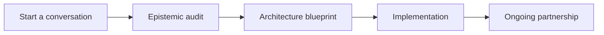
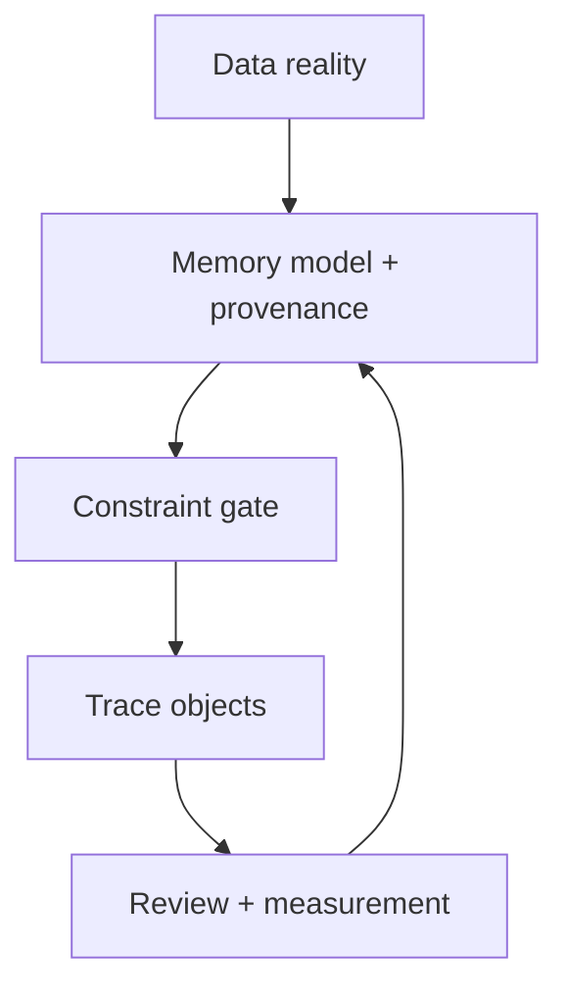

--8<-- "includes/quicknav.html"

# Services

	

		

			
Services → engagements

			<h2 class="landing-title">We don’t sell licenses. We sell epistemic safety.</h2>
			

				You can only trust an AI system if you can explain what it did, why it did it, and what would change the decision.
				Our services are designed to reduce hallucination risk and make outcomes measurable.
			

			

				<a class="md-button md-button--primary" href="start/">Start a Conversation</a>
				<a class="md-button" href="/methodology/">See the methodology</a>
				<a class="md-button" href="/reasoners/governance/">Governance approach</a>
			

		

	

## Engagements (pick the risk level you’re in)

	

		

			<h3>Epistemic Audit</h3>
			
Diagnosis: where hallucinations come from in your stack, and what a decision-grade roadmap looks like.

			
<a class="md-button md-button--primary" href="epistemic-audit/">Explore</a>

		

		

			<h3>Architecture Blueprint</h3>
			
Design: ontology, constraints, ingestion strategy, and a client-owned reference architecture.

			
<a class="md-button md-button--primary" href="blueprint/">Explore</a>

		

		

			<h3>Red-Team Evaluation Sprint</h3>
			
Stress test: adversarial prompts, policy edge cases, drift scenarios, and “unknown” handling — before it hits production.

			
<a class="md-button md-button--primary" href="epistemic-audit/">Explore</a>

		

		

			<h3>Implementation</h3>
			
Execution: build the glass-box memory layer, enforcement gates, traces, monitoring, and team handover.

			
<a class="md-button md-button--primary" href="implementation/">Explore</a>

		

		

			<h3>Governance &amp; Constraints Pack</h3>
			
Policy-as-code: encode rules, escalation paths, and shape validation so the system can deterministically block violations.

			
<a class="md-button md-button--primary" href="blueprint/">Explore</a>

		

		

			<h3>Ongoing Partnership</h3>
			
Retainer: continuous audits, governance updates, model reviews, and reliability tracking.

			
<a class="md-button md-button--primary" href="partnership/">Explore</a>

		

	

## Diagram: how engagements fit together

## Diagram: the risk-reduction loop we build

## Ready to discuss fit?

	

		

			The fastest start is usually an <strong>Epistemic Audit</strong>.
			If you already have clarity and sponsorship, go straight to a <strong>Blueprint</strong>.
		

		
<a class="md-button md-button--primary" href="start/">Start a Conversation</a>

	

