--8<-- "includes/quicknav.html"

# Services

	

		

			
Services → engagements

			<h2 class="landing-title">We don’t sell licenses. We sell epistemic safety.</h2>
			

				You can only trust an AI system if you can explain what it did, why it did it, and what would change the decision.
				Our services are designed to reduce hallucination risk and make outcomes measurable.
			

			

				<a class="md-button md-button--primary" href="/services/start/">Start a Conversation</a>
				<a class="md-button" href="/methodology/">See the methodology</a>
				<a class="md-button" href="/reasoners/governance/">Governance approach</a>
			

		

	

## Engagements (pick the risk level you’re in)

	

		

			<h3>Epistemic Audit</h3>
			
Diagnosis: where hallucinations come from in your stack, and what a decision-grade roadmap looks like.

			
<a class="md-button md-button--primary" href="/services/epistemic-audit/">Explore</a>

		

		

			<h3>Architecture Blueprint</h3>
			
Design: ontology, constraints, ingestion strategy, and a client-owned reference architecture.

			
<a class="md-button md-button--primary" href="/services/blueprint/">Explore</a>

		

		

			<h3>Red-Team Evaluation Sprint</h3>
			
Stress test: adversarial prompts, policy edge cases, drift scenarios, and “unknown†handling — before it hits production.

			
<a class="md-button md-button--primary" href="/services/epistemic-audit/">Explore</a>

		

		

			<h3>Implementation</h3>
			
Execution: build the glass-box memory layer, enforcement gates, traces, monitoring, and team handover.

			
<a class="md-button md-button--primary" href="/services/implementation/">Explore</a>

		

		

			<h3>Governance &amp; Constraints Pack</h3>
			
Policy-as-code: encode rules, escalation paths, and shape validation so the system can deterministically block violations.

			
<a class="md-button md-button--primary" href="/services/blueprint/">Explore</a>

		

		

			<h3>Ongoing Partnership</h3>
			
Retainer: continuous audits, governance updates, model reviews, and reliability tracking.

			
<a class="md-button md-button--primary" href="/services/partnership/">Explore</a>

		

	

    

### Services map (pages and how they connect)

```mermaid
flowchart TB
%% Styles (brModel Standard)
classDef i fill:#D3D3D3,stroke-width:0px,color:#000;
classDef p fill:#B3D9FF,stroke-width:0px,color:#000;
classDef r fill:#FFFFB3,stroke-width:0px,color:#000;
classDef o fill:#C1F0C1,stroke-width:0px,color:#000;
classDef s fill:#FFB3B3,stroke-width:0px,color:#000;

S_You("👤 You"):::s
I_Int(["🎯 What do you need right now?"]):::i

P_Start("📞 Start a conversation"):::p
P_Audit("🔎 Epistemic Audit"):::p
P_Blue("📐 Architecture Blueprint"):::p
P_Impl("🧑‍💻 Implementation"):::p
P_Partner("🤝 Ongoing Partnership"):::p

R_Road(["🧾 Roadmap + go/no-go gates"]):::r
R_Arch(["📐 Reference architecture + constraints scope"]):::r
R_Stack(["🧠 Governed memory + traces + monitoring"]):::r
O_Safe(["✅ Decision-grade operation"]):::o

R_Red(["🧪 Red-team evaluation sprint"]):::r
R_Pack(["🔒 Governance & constraints pack"]):::r

M_Method("📐 Methodology"):::p
M_Constr("🔒 Constraints & SHACL"):::p
R_Gov("🏛️ Governance approach"):::p

S_You --> I_Int --> P_Start
P_Start --> P_Audit --> R_Road --> P_Blue --> R_Arch --> P_Impl --> R_Stack --> P_Partner --> O_Safe

P_Audit --> R_Red
P_Blue --> R_Pack

R_Road -. "de-risks" .-> P_Blue
R_Arch -. "build plan" .-> P_Impl
P_Partner -. "keeps safe" .-> P_Impl

P_Audit -. "assesses" .-> R_Gov
P_Blue -. "encodes" .-> M_Constr
P_Impl -. "implements" .-> M_Method

%% Clickable nodes
click P_Start "/services/start/" "Start"
click P_Audit "/services/epistemic-audit/" "Epistemic Audit"
click P_Blue "/services/blueprint/" "Architecture Blueprint"
click P_Impl "/services/implementation/" "Implementation"
click P_Partner "/services/partnership/" "Ongoing Partnership"

click M_Method "/methodology/" "Methodology"
click M_Constr "/methodology/constraints/" "Constraints & SHACL"
click R_Gov "/reasoners/governance/" "Governance"
```

🧭 This is the <strong>Services router</strong>: start with <strong>📠intake</strong>, then move from <strong>🔠diagnosis</strong> → <strong>📠design</strong> → <strong>🧑‍💻 build</strong> → <strong>🤠continuous governance</strong>. The yellow boxes are optional accelerators (red-team and constraints pack) that attach to the phase where they are most effective.

## Diagram: how engagements fit together

```mermaid
flowchart TB
%% Styles (brModel Standard)
classDef i fill:#D3D3D3,stroke-width:0px,color:#000;
classDef p fill:#B3D9FF,stroke-width:0px,color:#000;
classDef r fill:#FFFFB3,stroke-width:0px,color:#000;
classDef o fill:#C1F0C1,stroke-width:0px,color:#000;
classDef s fill:#FFB3B3,stroke-width:0px,color:#000;

P_Start("📞 Start"):::p
I_Min(["📥 Minimal inputs: decision, data, constraints"]):::i
G_Enough{"Clarity sufficient?"}:::s

P_Audit("🔎 Epistemic Audit"):::p
R_Find(["🧾 Findings: risks, gaps, gates"]):::r
G_GoA{"Proceed?"}:::s

P_Blue("📐 Blueprint"):::p
R_Design(["📐 Design: ontology, constraints, trace schema"]):::r
G_GoB{"Ready to build?"}:::s

P_Impl("🧑‍💻 Implementation"):::p
R_Ship(["🧠 Governed system + monitoring"]):::r
G_Need{"Ongoing governance?"}:::s

P_Part("🤝 Partnership"):::p
O_Stable(["✅ Stable decision-grade operation"]):::o
O_Stop(["🛑 Stop / rescope (not a fit yet)"]):::s

P_Start --> I_Min --> G_Enough
G_Enough -->|"no"| P_Audit --> R_Find --> G_GoA
G_Enough -->|"yes"| P_Blue

G_GoA -->|"no"| O_Stop
G_GoA -->|"yes"| P_Blue

P_Blue --> R_Design --> G_GoB
G_GoB -->|"no"| P_Audit
G_GoB -->|"yes"| P_Impl --> R_Ship --> G_Need

G_Need -->|"yes"| P_Part --> O_Stable
G_Need -->|"no"| O_Stable

%% Clickable nodes
click P_Start "/services/start/" "Start"
click P_Audit "/services/epistemic-audit/" "Epistemic Audit"
click P_Blue "/services/blueprint/" "Blueprint"
click P_Impl "/services/implementation/" "Implementation"
click P_Part "/services/partnership/" "Partnership"
```

🚦 This diagram makes the <strong>decision points</strong> explicit: we start from minimal inputs, decide whether an <strong>🔠audit</strong> is needed to reach design clarity, gate the move into <strong>📠blueprint</strong>, and only then commit to <strong>🧑‍💻 implementation</strong>. Partnership is a deliberate choice based on how much ongoing change you expect.

## Diagram: the risk-reduction loop we build

```mermaid
flowchart TB
%% Styles (brModel Standard)
classDef i fill:#D3D3D3,stroke-width:0px,color:#000;
classDef p fill:#B3D9FF,stroke-width:0px,color:#000;
classDef r fill:#FFFFB3,stroke-width:0px,color:#000;
classDef o fill:#C1F0C1,stroke-width:0px,color:#000;
classDef s fill:#FFB3B3,stroke-width:0px,color:#000;

I_Data(["📥 Data reality (files, DBs, policies)"]):::i
P_Model("🧠 Memory model + provenance"):::p
P_Gate("🔒 Constraint gate"):::p
G_OK{"Constraints pass?"}:::s
R_Trace(["🧾 Trace package (path, evidence, rules)"]):::r
R_Measure(["📊 Review + measurement (gates, drift, incidents)"]):::r
O_Improve(["✅ Controlled improvement loop"]):::o

S_Block(["🛑 Refuse + record reason"]):::s

I_Data --> P_Model --> P_Gate --> G_OK
G_OK -->|"yes"| R_Trace --> R_Measure --> P_Model
G_OK -->|"no"| S_Block --> R_Measure 
R_Measure --> O_Improve

%% Clickable nodes
click P_Gate "/methodology/constraints/" "Constraints & SHACL"
click R_Trace "/methodology/brcausalgraphrag/" "Trace objects"
click P_Model "/methodology/property-and-knowledge-graphs/" "Graphs"
```

🔠This is the <strong>risk-reduction flywheel</strong>: improve reliability by enforcing <strong>🔒 constraints</strong>, generating <strong>🧾 trace artifacts</strong>, and turning incidents into measurable model/ontology/constraint updates. Refusal is a first-class outcome, not a bug.

## Ready to discuss fit?

	

		

			The fastest start is usually an <strong>Epistemic Audit</strong>.
			If you already have clarity and sponsorship, go straight to a <strong>Blueprint</strong>.
		

		
<a class="md-button md-button--primary" href="/services/start/">Start a Conversation</a>

	

