--8<-- "includes/quicknav.html"

# Ongoing Partnership

	

		

			
Services → continuity

			<h2 class="landing-title">Stay decision-grade while everything around you changes.</h2>
			

				Model updates, policy updates, and new data sources will keep arriving.
				Partnership is how you keep governance, evaluation, and reliability in lockstep — continuously.
			

			

				<a class="md-button md-button--primary" href="start/">Start a Conversation</a>
				<a class="md-button" href="epistemic-audit/">Epistemic Audit</a>
				<a class="md-button" href="/reasoners/governance/">Governance approach</a>
			

		

	

## What we do

	

		
<h3>Periodic audits</h3>
Failure-mode analysis, regression checks, and adversarial testing tailored to your domain.

		
<h3>Governance updates</h3>
Rule reviews, constraint evolution, and traceability requirements as policy changes.

		
<h3>Architecture reviews</h3>
Integration reviews for new tools, new endpoints, and new data sources.

		
<h3>Measurement &amp; tracking</h3>
Reliability metrics, drift signals, and “go/no-go†gates for changes.

		
<h3>Incident support</h3>
Postmortems with trace artifacts: what failed, why it failed, and which constraint or data fix prevents recurrence.

		
<h3>Model &amp; vendor reviews</h3>
Change-impact assessment for new model versions and providers: behavior shifts, governance risk, and trace comparability.

	

## Diagram: continuous governance loop

```mermaid
flowchart TB
%% Styles (brModel Standard)
classDef i fill:#D3D3D3,stroke-width:0px,color:#000;
classDef p fill:#B3D9FF,stroke-width:0px,color:#000;
classDef r fill:#FFFFB3,stroke-width:0px,color:#000;
classDef o fill:#C1F0C1,stroke-width:0px,color:#000;
classDef s fill:#FFB3B3,stroke-width:0px,color:#000;

I_Chg(["🧩 Change arrives<br>(model, policy, data, scope)"]):::i
P_Review("🔎 Review impact"):::p
P_Update("🔒 Update constraints + ontology"):::p
P_Test("🧪 Evaluate + red-team"):::p
G_OK{"Pass?"}:::s
O_Deploy(["✅ Deploy safely"]):::o
S_Fix(["🛠️ Fix + re-test"]):::s
R_Mon(["📊 Monitor (drift, violations, incidents)"]):::r

I_Chg --> P_Review --> P_Update --> P_Test --> G_OK
G_OK -->|"yes"| O_Deploy --> R_Mon --> P_Review
G_OK -->|"no"| S_Fix --> P_Test

%% Clickable nodes
click P_Update "/methodology/constraints/" "Constraints & SHACL"
click P_Test "/services/epistemic-audit/" "Audit mindset"
click R_Mon "/reasoners/operating-model/" "Operating model"
```

🔠This diagram is the <strong>continuous governance loop</strong>: changes are inevitable, so we route them through impact review, updates to <strong>🔒 constraints</strong> and semantics, red-team evaluation, and only then deploy. Monitoring closes the loop and prevents slow reliability decay.

## Diagram: why model updates are never “just a model update”

```mermaid
flowchart TB
%% Styles (brModel Standard)
classDef i fill:#D3D3D3,stroke-width:0px,color:#000;
classDef p fill:#B3D9FF,stroke-width:0px,color:#000;
classDef r fill:#FFFFB3,stroke-width:0px,color:#000;
classDef o fill:#C1F0C1,stroke-width:0px,color:#000;
classDef s fill:#FFB3B3,stroke-width:0px,color:#000;

I_M(["🧠 Model update"]):::i
R_Shift(["🌦️ Behavior shift"]):::r
R_Gov(["🔒 Governance risk"]):::r
R_Eval(["🧪 Evaluation drift"]):::r
R_Trace(["🧾 Trace comparability risk"]):::r
P_Gates("🚦 Update gates + tests"):::p
O_Ready(["✅ Change is safe to deploy"]):::o

I_M --> R_Shift
R_Shift --> R_Gov --> P_Gates
R_Shift --> R_Eval --> P_Gates
R_Shift --> R_Trace --> P_Gates
P_Gates --> O_Ready

%% Clickable nodes
click P_Gates "/reasoners/governance/" "Governance approach"
click R_Trace "/methodology/brcausalgraphrag/" "Trace objects"
```

🧠 This diagram explains the causal coupling: a model update shifts behavior, which changes governance risk, evaluation baselines, and trace comparability. The fix is never “trust the new model†— it is <strong>🚦 updating gates and tests</strong> so safety remains deterministic.

## Typical outcomes

	

		<ul>
			<li>Fewer surprises in production</li>
			<li>Faster approvals for safe changes</li>
			<li>Clear incident postmortems with trace artifacts</li>
			<li>A system that stays governable as scope grows</li>
		</ul>
		
<a class="md-button md-button--primary" href="start/">Start a Conversation</a>

	

