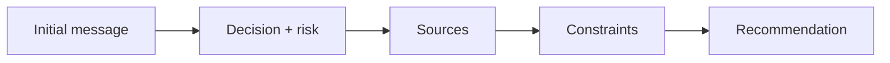
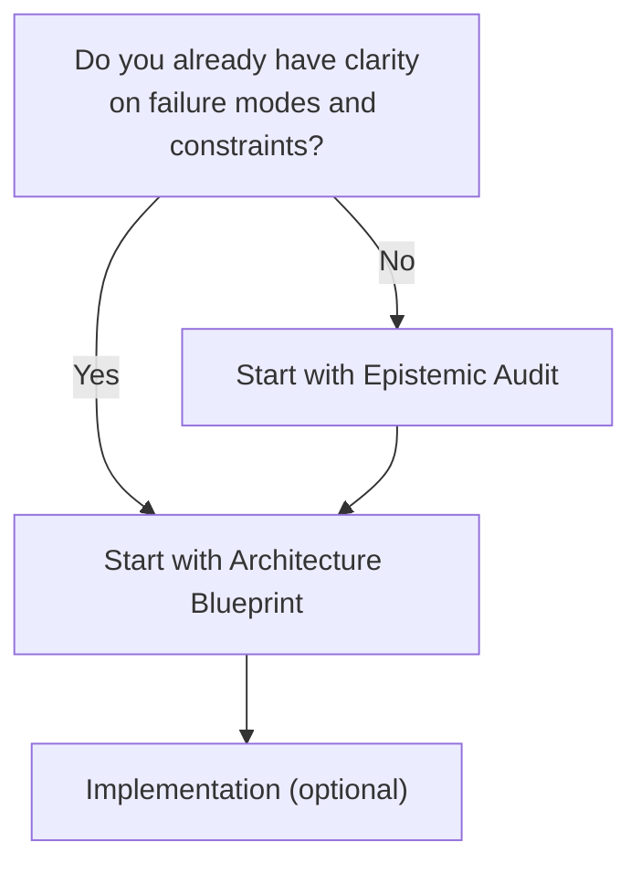

--8<-- "includes/quicknav.html"

# Start a Conversation

	

		

			
Services → contact

			<h2 class="landing-title">Start small. Get clarity fast.</h2>
			

				This is a lightweight entry point.
				In one short exchange, we can usually tell whether your problem is best solved with constraints, better evaluation, better semantics — or not with AI at all.
			

			

				<a class="md-button md-button--primary" href="epistemic-audit/">Epistemic Audit</a>
				<a class="md-button" href="blueprint/">Architecture Blueprint</a>
				<a class="md-button" href="/methodology/">Methodology</a>
			

		

		

			
		

	

	<h2>We’re a strong fit if</h2>
	

		
<h3>Hallucination is unacceptable</h3>
You need a system that can abstain, justify, and prove its boundaries.

		
<h3>Audits or compliance matter</h3>
You need traceability and enforceable rules, not “best effort”.

		
<h3>Your data reality is messy</h3>
PDF + SQL + KBs + tribal knowledge. The hard part is not the model — it’s the semantics.

		
<h3>You expect model churn</h3>
You want an architecture that stays stable even as models change.

	

	<h2>What we need (minimal)</h2>
	

		<ol>
			<li><strong>The decision</strong> you want to support (and what must never be wrong)</li>
			<li><strong>The data sources</strong> involved (and who owns them)</li>
			<li><strong>The constraints/policies</strong> that govern the domain</li>
		</ol>
	

	<h2>Diagram: intake flow</h2>

	<h2>How to start (recommended)</h2>
	

		
<strong>Start with an Epistemic Audit</strong> if you want clarity fast.

		
Start with a Blueprint if you already know you must build durable semantics and constraints.

	

	

		

			<a class="md-button md-button--primary" href="epistemic-audit/">Epistemic Audit</a>
			<a class="md-button" href="blueprint/">Architecture Blueprint</a>
			<a class="md-button" href="implementation/">Implementation</a>
		

	

	<h2>Contact channel (your call)</h2>
	

		

			Tell me what contact channel you prefer to publish (email address, Calendly link, or another method).
			I’ll place it here and also mirror it in the About section so it’s easy to find.
		

	

