--8<-- "includes/quicknav.html"

# Start a Conversation

	

		

			
Services → contact

			<h2 class="landing-title">Start small. Get clarity fast.</h2>
			

				This is a lightweight entry point.
				In one short exchange, we can usually tell whether your problem is best solved with constraints, better evaluation, better semantics — or not with AI at all.
			

			

				<a class="md-button md-button--primary" href="/services/epistemic-audit/">Epistemic Audit</a>
				<a class="md-button" href="/services/blueprint/">Architecture Blueprint</a>
				<a class="md-button" href="/methodology/">Methodology</a>
			

		

	

## We’re a strong fit if

	

		
<h3>Hallucination is unacceptable</h3>
You need a system that can abstain, justify, and prove its boundaries.

		
<h3>Audits or compliance matter</h3>
You need traceability and enforceable rules, not “best effort”.

		
<h3>Your data reality is messy</h3>
PDF + SQL + KBs + tribal knowledge. The hard part is not the model — it’s the semantics.

		
<h3>You expect model churn</h3>
You want an architecture that stays stable even as models change.

		
<h3>You need decisions, not chat</h3>
You care about action selection with constraints and traces — not just “grounded†answers that can’t be audited.

		
<h3>Your policies evolve</h3>
Rules, approvals, and risk posture change. You need governance that can be updated, tested, and enforced deterministically.

	

## What we need (minimal)

	

		<ol>
			<li><strong>The decision</strong> you want to support (and what must never be wrong)</li>
			<li><strong>The data sources</strong> involved (and who owns them)</li>
			<li><strong>The constraints/policies</strong> that govern the domain</li>
		</ol>
	

## How to start (recommended)

	

		
<strong>Start with an Epistemic Audit</strong> if you want clarity fast.

		
Start with a Blueprint if you already know you must build durable semantics and constraints.

	

## Diagram: intake triage (how we route you)

```mermaid
flowchart TB
%% Styles (brModel Standard)
classDef i fill:#D3D3D3,stroke-width:0px,color:#000;
classDef p fill:#B3D9FF,stroke-width:0px,color:#000;
classDef r fill:#FFFFB3,stroke-width:0px,color:#000;
classDef o fill:#C1F0C1,stroke-width:0px,color:#000;
classDef s fill:#FFB3B3,stroke-width:0px,color:#000;

I_In(["📥 Inputs: decision, data reality, constraints"]):::i
P_Scope("🧭 Clarify scope and risk"):::p
G_Hi{"High stakes?"}:::s

P_Audit("🔎 Epistemic Audit"):::p
R_Diag(["🧾 Diagnosis: failure modes + roadmap"]):::r

P_Blue("📐 Architecture Blueprint"):::p
R_Arch(["📐 Design: ontology + constraints + gates"]):::r

P_Impl("🧑‍💻 Implementation"):::p
O_Ship(["✅ Governed system in production"]):::o

I_In --> P_Scope --> G_Hi
G_Hi -->|"yes"| P_Audit --> R_Diag --> P_Blue
G_Hi -->|"no"| P_Blue
P_Blue --> R_Arch --> P_Impl --> O_Ship

%% Clickable nodes
click P_Audit "/services/epistemic-audit/" "Epistemic Audit"
click P_Blue "/services/blueprint/" "Architecture Blueprint"
click P_Impl "/services/implementation/" "Implementation"
```

🧭 This diagram shows the <strong>routing logic</strong>: we start from three minimal inputs (decision, data, constraints), clarify risk, and then route you to the smallest engagement that reduces uncertainty fast — usually <strong>🔠Audit</strong> or <strong>📠Blueprint</strong>, then <strong>🧑‍💻 build</strong>.

## Diagram: what “minimal inputs” really mean

```mermaid
flowchart TB
%% Styles (brModel Standard)
classDef i fill:#D3D3D3,stroke-width:0px,color:#000;
classDef p fill:#B3D9FF,stroke-width:0px,color:#000;
classDef r fill:#FFFFB3,stroke-width:0px,color:#000;
classDef o fill:#C1F0C1,stroke-width:0px,color:#000;
classDef s fill:#FFB3B3,stroke-width:0px,color:#000;

R_Dec(["🎯 The decision<br>(and unacceptable errors)"]):::r
R_Data(["📥 Data sources<br>(who owns what)"]):::r
R_Pol(["🔒 Constraints / policies<br>(what must never happen)"]):::r

O_Map(["🧾 Output: scope map<br>(what we can prove vs what we must abstain)"]):::o

G_Min{"Inputs sufficient?"}:::s
S_Miss(["🛑 Missing inputs (explicit list)"]):::s
O_Next(["✅ Next step: audit or blueprint"]):::o

R_Dec --> G_Min
R_Data --> G_Min
R_Pol --> G_Min

G_Min -->|"no"| S_Miss
G_Min -->|"yes"| O_Map --> O_Next

%% Clickable nodes
click R_Pol "/methodology/constraints/" "Constraints & SHACL"
click O_Map "/services/epistemic-audit/" "Epistemic Audit"
```

🚦 This diagram adds the missing <strong>decision mechanism</strong>: we explicitly check whether the three inputs are sufficient. If not, we can list what’s missing (instead of guessing). If yes, we can produce a <strong>🧾 scope map</strong> that separates what is provable vs what must be handled via abstention/escalation, and route you to the right next step.

		

			<a class="md-button md-button--primary" href="/services/epistemic-audit/">Epistemic Audit</a>
			<a class="md-button" href="/services/blueprint/">Architecture Blueprint</a>
			<a class="md-button" href="/services/implementation/">Implementation</a>
		

## Contact

	

		
<strong>Prefer a form?</strong> Use the embedded Notion intake below.

		<iframe
			src="https://bigring.notion.site/ebd//2ed90bcdd8ae808a91dcffb2a49454e9"
			width="100%"
			height="900"
			style="border:0"
			loading="lazy"
			allowfullscreen>
		</iframe>
	

