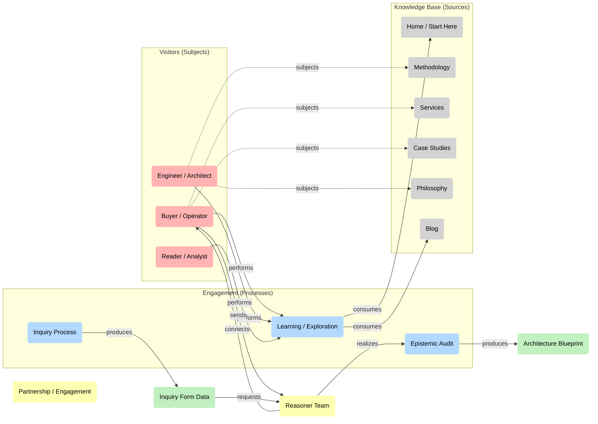

# Wizard (Full-Width Diagram Template)

Use this page as a sandbox for diagrams that need horizontal space.

The goal is simple: keep context around the diagram (what it is, why it matters, what to do next), while removing side navigation and the right-hand table of contents so the visual model fits.

## Diagram

## Notes below the diagram

Put interpretation here: what the diagram claims causally, what you want the reader to notice first, and what data (or page) would falsify the model.

If you want, the next iteration can also:

- Add a second diagram (e.g., a feedback loop view) under this one.
- Add a small legend and “assumptions” box above the diagram.
- Turn this into a step-by-step wizard (tabs/sections) while keeping the full-width layout.
