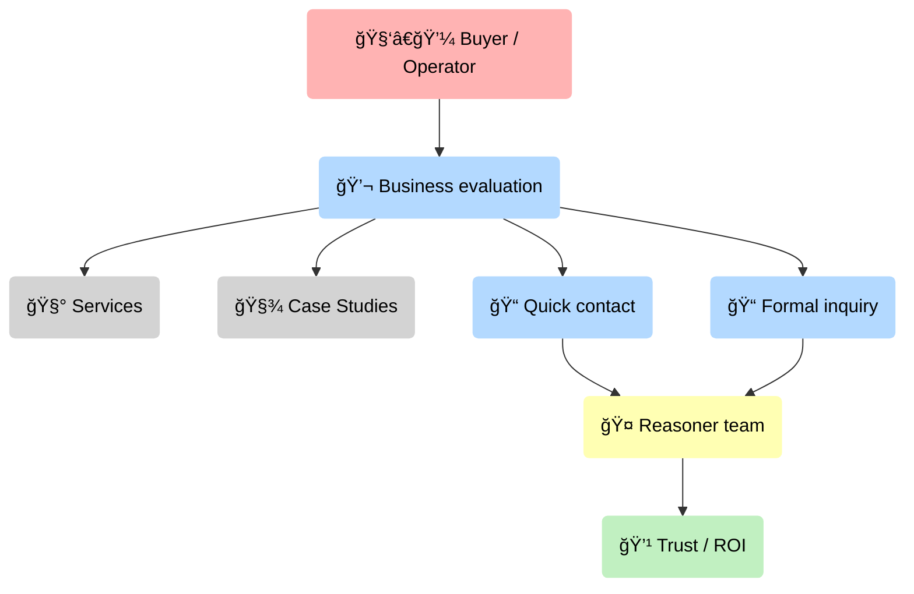
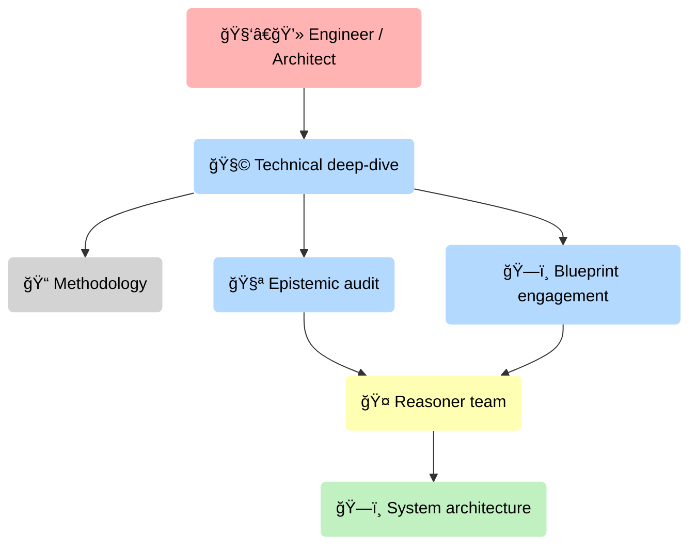
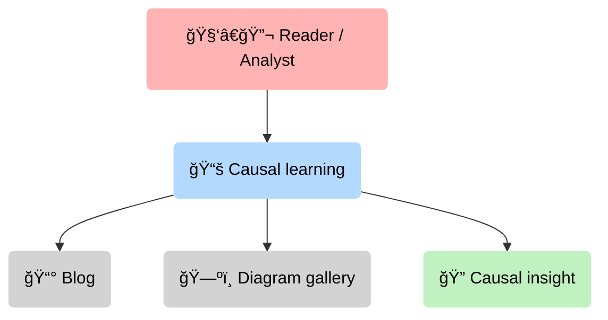
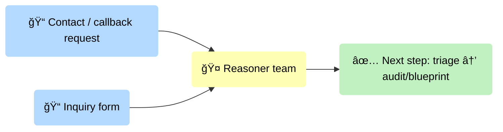

# Wizard — Visitor → Role → Value

This page is a full-width workspace for “big picture → drill-down” causal/flow diagrams.

**How to use it**

- Start with a compact overview diagram.
- Click a node (role/process) to jump to its detailed section below.
- Keep each detailed diagram small enough to read without zoom.

  <a class="md-button md-button--primary" href="#overview">Overview</a>
  <a class="md-button" href="#buyer">Buyer / Operator</a>
  <a class="md-button" href="#engineer">Engineer / Architect</a>
  <a class="md-button" href="#reader">Reader / Analyst</a>
  <a class="md-button" href="#inquiry-inputs">Inquiry inputs</a>

## Overview {#overview .wizard-section}

```mermaid
flowchart TB
%% Styles (brModel Standard)
classDef s fill:#FFB3B3,stroke-width:0px,color:#000;
classDef p fill:#B3D9FF,stroke-width:0px,color:#000;
classDef r fill:#FFFFB3,stroke-width:0px,color:#000;
classDef o fill:#C1F0C1,stroke-width:0px,color:#000;

%% Entry
S_Visitor("👤 Visitor"):::s
P_Orient("🧭 Orientation"):::p
P_Ident("🧭 Self-identification"):::p

S_Visitor --> P_Orient --> P_Ident

%% Before evaluation, the visitor usually needs context.
P_Who("🧑‍🏫 Understand who we are"):::p
P_Learn("📚 Learn about causality"):::p
P_Philosophy("🧠 Study philosophy"):::p
P_Method("📐 Study methodology"):::p
P_Reasoners("🤝 Understand Reasoners"):::p
P_BrowseCases("🧾 Review case studies"):::p
P_BrowseBlog("📰 Browse the blog"):::p
P_BrowseDiagrams("🗺️ Browse diagrams"):::p

P_Ident --> P_Who
P_Who --> P_Learn
P_Learn --> P_Philosophy
P_Philosophy --> P_Method

P_Learn --> P_BrowseBlog
P_BrowseBlog --> P_BrowseDiagrams

P_Who --> P_Reasoners
P_Method --> P_BrowseCases
P_Reasoners --> P_BrowseCases

%% Two evaluations, one trust (no duplicated nodes)
P_Biz("💬 Evaluate business fit"):::p
P_Tech("🧩 Evaluate technical fit"):::p
P_Trust("🤝 Build trust"):::p

P_BrowseCases --> P_Biz
P_BrowseCases --> P_Tech
P_Method --> P_Tech
P_Who --> P_Biz

P_Biz --> P_Trust
P_Tech --> P_Trust

%% Commitment sequence
P_Contact("📞 Start a conversation"):::p
P_Inquiry("📝 Submit an inquiry"):::p
R_Engage("🤝 Engagement"):::r
P_Delivery("🛠️ Delivery"):::p

P_Trust --> P_Contact --> P_Inquiry --> R_Engage --> P_Delivery

%% What delivery can look like (high-level outcomes)
O_Audit("🟢 Epistemic audit"):::o
O_Blueprint("🟢 Architecture blueprint"):::o
O_Impl("🟢 Implementation"):::o
O_Partner("🟢 Ongoing partnership"):::o

P_Delivery --> O_Audit
P_Delivery --> O_Blueprint
P_Delivery --> O_Impl
P_Delivery --> O_Partner

%% Links (process → detailed explanation)
click P_Orient "/home/start-here/" "Start Here"
click P_Ident "/home/start-here/#choose-your-role" "Choose your role"
click P_Who "/reasoners/about/" "About"
click P_Learn "/philosophy/correlation-vs-causality/" "Correlation vs Causality"
click P_Philosophy "/philosophy/" "Philosophy"
click P_Method "/methodology/" "Methodology"
click P_Reasoners "/reasoners/" "Reasoners"
click P_BrowseCases "/case-studies/" "Case Studies"
click P_BrowseBlog "/blog/" "Blog"
click P_BrowseDiagrams "/diagrams/" "Diagram Gallery"
click P_Biz "/services/" "Services"
click P_Tech "/methodology/" "Methodology"
click P_Trust "/services/epistemic-audit/" "Epistemic Audit"
click P_Contact "/services/start/" "Start a conversation"
click P_Inquiry "/home/inquiry/" "Inquiry"
click R_Engage "/services/" "Engagement model"
click P_Delivery "/services/" "Services"
click O_Audit "/services/epistemic-audit/" "Epistemic Audit"
click O_Blueprint "/services/blueprint/" "Architecture Blueprint"
click O_Impl "/services/implementation/" "Implementation"
click O_Partner "/services/partnership/" "Ongoing Partnership"
```

<strong>The causal question this page answers</strong>: How does a first-time visitor self-identify, and which mental path leads them to real value (learning, dialogue, or an actionable engagement)?

### Legend (icon intent)

- **People/roles** use a human icon (👤/🧑‍💼/🧑‍💻/🧑‍🔬).
- **Processes** use action/route icons (🧭/💬/🧩/📚).
- **Sources/pages** use “object” icons (🧰/📐/📰/🧾).
- **Outputs/value** use outcome icons (💹/🏗️/🔎).

---

## Buyer / Operator {#buyer .wizard-section}

**Typical intent:** “Can you solve my problem with acceptable risk, budget, and governance?”

The causal hinge here is *trust formation*: the buyer needs enough evidence to justify a next step (call, written response, or a formal inquiry).

Back to [Overview](#overview).

---

## Engineer / Architect {#engineer .wizard-section}

**Typical intent:** “Is this technically real? Where does it plug in? What fails, and how do you make it enforceable?”

The causal hinge here is *implementation credibility*: you earn trust by making constraints, integration boundaries, and failure modes explicit.

Back to [Overview](#overview).

---

## Reader / Analyst {#reader .wizard-section}

**Typical intent:** “Teach me the model. Show me the mechanism. Give me a diagram I can argue with.”

The causal hinge here is *learning-to-insight conversion*: the reader needs structure (models, counterfactuals, diagrams), not just prose.

Back to [Overview](#overview).

---

## Inquiry inputs (two forms) {#inquiry-inputs .wizard-section}

You mentioned two key inputs that convert “interest” into an actionable engagement:

1) **Contact / callback request** (fast, lightweight)
2) **Inquiry form** (structured, decision-grade)

These are currently specified in the workspace source file `localSource/forms-descrition.md` (used as internal truth for field design).

Back to [Overview](#overview).
